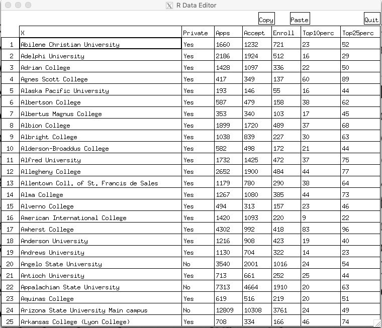
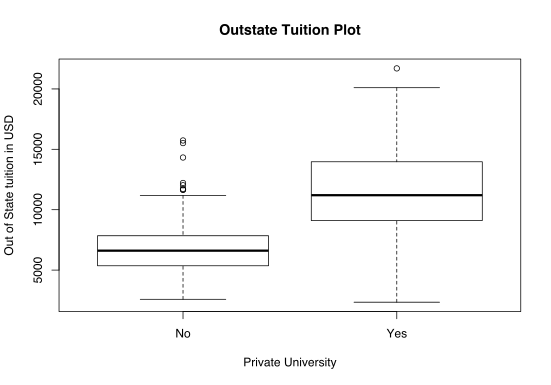

# Home work 1

@author: Igor Ostaptchenko igor_ost@wayne.edu AKA borodark@gmail.com

## 2.4 Excercises

### 1. For each of parts (a) through (d), indicate whether we would generally expect the performance of a flexible statistical learning method to be better or worse than an inflexible method. Justify your answer.

#### a) The sample size n is extremely large, and the number of predictors p is small.

Better! The flexible model will fit the data without overfiting, due to errors being minimized on the large number of observations.

#### b) The number of predictors p is extremely large, and the number of observations n is small.

Worse! A fewer data points will cause the overfit.

#### c) The relationship between the predictors and response is highly non-linear.

Better! The flexible model better expresses non-linearity in the data.

#### d) The variance of the error terms, i.e. σ2=Var(ϵ), is extremely high.

Worse! The flexible model will follow the noise/errors more precisely giving higher errors on different dataset.


### 2. Explain whether each scenario is a classification or regression problem, and indicate whether we are most interested in inference or prediction. Finally, provide n and p.


#### a) We collect a set of data on the top 500 firms in the US. For each firm we record profit, number of employees, industry and the CEO salary. We are interested in understanding which factors affect CEO salary.

- regression: the funtion of _Salary_ from _qianitative Profit_, _quanttative Number of Employees_, and _categorical Industry_ variables
- inference: the relationship between predictors in found parameters of fit
- *n*: 500
- *p*: 3


#### b) We are considering lauching a new product and wish to know whether it will be a success or a failure. We collect data on 20 similar products that were previously launched. For each product we have recorded whether it was a success or failure, price charged for the product, marketing budget, competition price, and the other variables.

- classification: find whether the product succeed or fail given the _price_, _marketing budget_, _etc_ ...
- prediction: measuring the probability of either for given values of the predictors
- *n*: 20
- *p*: 13


#### c) We are interesting in predicting the % change in the US dollar in relation to the weekly changes in the world stock markets. Hence we collect weekly data for all of 2012. For each week we record the % change in the dollar, the % change in the US market, the % change in the British Market, and the % change in the German market.

- regression: finding smooth function
- prediction: use the function to get outcome given the space of parameter values
- *n*: 52
- *p*: 5


### 3. We now revisit the bias-variance decomposition.

#### a) Provide a sketch of typical (squared) bias, variance, training error, test error, and Bayes (or irreducible) error curves, on a single plot, as we go from less flexible statistical learning methods towards more flexible approaches. The x-axis should represent the amount of flexibility in the method, and the y-axis should represent the values for each curve. There should be five curves. Make sure to label each one.


#### b) Explain why each of the five curves has the shape displayed in part (a).
- _training error_ declines as flexibility increases: the selected  _f_ curve able to follow the data closely
- _test error_ intially declines when lexibility increases, it stops to fall and passing the valley starts to increase again cause the overfited _f_ curve gives more erros on test data
- _irreducible error_ is a constant hence the line is passing below the _test erros_ curve: the expected _test erros_ will be greater than _Var(ε)_
- _bias_ decreases as the levels of flexibility creates more complex function that more precisely approximate the system but stopped being impacted at some point
- _variance_ increases slowly with higher levels of flexibility, then increases rapidly causing _test errors_ to rise


### 4. You will now think of some real-life applications for statistical learning.

#### a) Describe three real-life applications in which classification might be useful. Describe the response, as well as the predictors. Is the goal of each application inference or prediction? Explain your answer.

- recommend the mortgage products according to the potential customer atributes: age, work status, income, assets, loan amount, etc: inference.
- estimate the default for the debt products based on age, income, occupation, industry of employment, family status, life events: prediction.
- make decision to stop the production process and tune the mill based of the variation of sizes of the produced part: inference - classify the situation as the need for the adjustments.

#### b) Describe three real-life applications in which regression might be useful. Describe the response, as well as the predictors. Is the goal of each application inference or prediction ? Explain your answer.

- provide decompression time given certain gas mixure needed for SCUBA diver to avoid bends as function of time spent at certain deps, using particular breathing mixture with several fixed percentages of _Oxigen_ vs other gasses: _N_ and _He_. It's inferense: the model is set in dive computer
- Perdict sesonal flow of the water streams based on the data collected each day, over years, on levels of rain, temperature, depth of snow, air and water temperatures.
- feed optimal charding current for the batteries based of model, describing optimal charging rate for batery chemistry type, the adsorbed capacity, actual voltage, time. It is inference: different battery chemistry uses different models of charging.

#### c) Describe three real-life applications in which cluster analysis might be useful.

- find what factors contibutes to certain disease: age, gender, food, sleap time, execise time, recreational drugs: alcohol, coffe, etc. Perdiction: find what illness are common for the group with similar habits.
- recommend the music based on the lisened and liked songs, discover the concentration of songs around collaborationg artists for the songs one likes.
- find the list of topics for the news letter to maximise the click rates based on similarity of interests of the targets.


### 5. What are the advantages and disadvantages of a very flexible (versus a less flexible) approach for regression or classification? Under what circumstances might a more flexible approach be preferred to a less flexible approach? When might a less flexible approach be preferred?

Advantages: Produces less bias representing complex and non-linear systems.
Disadvantages: May overfits training data, have higher variance.

More flexible approachs have to be used to get the reasonable fit, espesially when data contains substantial non-linearity. The less flexible aproaches shall be used when the dataset has fewer observations, for more interpretability, for limiting the solution space to the linear system for computational power reasons.


### 6. Describe the differences between a parametric and a non-parametric statistical learning approach. What are the advantages of a parametric approach to regression or classification (as opposed to a non-parametric approach)? What are its disavantages?

The Parametric approach makes assumptions about the form the function: linear or polinomial, more or less flexible. The choice will be choice of minimun errors of a fitted function. This model based approach is called parametric approach. Linear/Logistical Regressions are among these. 

The non-parametric approach does not make assumptions of shape of functions. Instead we estimate the function which fits closely to the data. SVM and various spline method use non-parametric approach.

Advantages: 
- Parametric approach can fit any kind of data choosing wide range of functions
- can fit something with lower size of sample compared to Non-Parametric, where the bigger sample size is needed to achive comparable performance. 

Disadvantages:
- Parametric approach is prone to overfiting when too flexible model is selected during training, that leads to large test errors
- The errors will be higher for less flexible models with fewer parameters.


### 7. The table below provides a training data set containing six observations, three predictors, and one qualitative response variable.

Suppose we wish to use this data set to make a prediction for Y when X1=X2=X3=0 using K-nearest neighbors.

#### a) Compute the Euclidean distance between each observation and the test point, X1=X2=X3=0

The Euclidean distance between points p and q is the lenght of the line segment connecting them.

```
|            -- | --                    |       -- |
| observation # | formula               | distance |
|             1 | sqrt(3^2)             |        3 |
|             2 | sqrt(2^2)             |        2 |
|             3 | sqrt(1^2 + 3^2)       |     3.16 |
|             4 | sqrt(1^2 + 2^2)       |     2.24 |
|             5 | sqrt(1^2 + 1^2)       |     1.41 |
|             6 | sqrt(1^2 + 1^2 + 1^2) |     1.73 |
```

#### b) What is our prediction with K=1? Why?

The closest to 1 is the value for observation 5 hence it is *Green*.

#### c) What is our prediction with K=3? Why?

The closest to 3 are observations 1, 3 and 4: 2/3 for Red and 1/3 for Green, hence: *Red*

#### d) If the Bayes decision boundary in this problem is highly non-linear, then would we expect the best value for K to be large or small? Why?

Bigger K causes more linear, less curvy boundaries. The better value for K is small. The level of flexibility is inversely depends on the number of K.

### 8. This exercise relates to the “College” data set, which can be found in the file “College.csv”. It contains a number of variables for 777 different universities and colleges in the US.

#### a) Use the read.csv() function to read the data into R. Call the loaded data “college”. Make sure that you have the directory set to the correct location for the data.

```
> college <- read.csv("College.csv")
> fix(college)
> rownames(college)=college[,1]
> college <- college[, -1]
> head(college[, 1:5])
                             Private Apps Accept Enroll Top10perc
Abilene Christian University     Yes 1660   1232    721        23
Adelphi University               Yes 2186   1924    512        16
Adrian College                   Yes 1428   1097    336        22
Agnes Scott College              Yes  417    349    137        60
Alaska Pacific University        Yes  193    146     55        16
Albertson College                Yes  587    479    158        38
```




i. summary()

```
> summary(college)
 Private        Apps           Accept          Enroll       Top10perc       Top25perc    
 No :212   Min.   :   81   Min.   :   72   Min.   :  35   Min.   : 1.00   Min.   :  9.0  
 Yes:565   1st Qu.:  776   1st Qu.:  604   1st Qu.: 242   1st Qu.:15.00   1st Qu.: 41.0  
           Median : 1558   Median : 1110   Median : 434   Median :23.00   Median : 54.0  
           Mean   : 3002   Mean   : 2019   Mean   : 780   Mean   :27.56   Mean   : 55.8  
           3rd Qu.: 3624   3rd Qu.: 2424   3rd Qu.: 902   3rd Qu.:35.00   3rd Qu.: 69.0  
           Max.   :48094   Max.   :26330   Max.   :6392   Max.   :96.00   Max.   :100.0  
  F.Undergrad     P.Undergrad         Outstate       Room.Board       Books       
 Min.   :  139   Min.   :    1.0   Min.   : 2340   Min.   :1780   Min.   :  96.0  
 1st Qu.:  992   1st Qu.:   95.0   1st Qu.: 7320   1st Qu.:3597   1st Qu.: 470.0  
 Median : 1707   Median :  353.0   Median : 9990   Median :4200   Median : 500.0  
 Mean   : 3700   Mean   :  855.3   Mean   :10441   Mean   :4358   Mean   : 549.4  
 3rd Qu.: 4005   3rd Qu.:  967.0   3rd Qu.:12925   3rd Qu.:5050   3rd Qu.: 600.0  
 Max.   :31643   Max.   :21836.0   Max.   :21700   Max.   :8124   Max.   :2340.0  
    Personal         PhD            Terminal       S.F.Ratio      perc.alumni   
 Min.   : 250   Min.   :  8.00   Min.   : 24.0   Min.   : 2.50   Min.   : 0.00  
 1st Qu.: 850   1st Qu.: 62.00   1st Qu.: 71.0   1st Qu.:11.50   1st Qu.:13.00  
 Median :1200   Median : 75.00   Median : 82.0   Median :13.60   Median :21.00  
 Mean   :1341   Mean   : 72.66   Mean   : 79.7   Mean   :14.09   Mean   :22.74  
 3rd Qu.:1700   3rd Qu.: 85.00   3rd Qu.: 92.0   3rd Qu.:16.50   3rd Qu.:31.00  
 Max.   :6800   Max.   :103.00   Max.   :100.0   Max.   :39.80   Max.   :64.00  
     Expend        Grad.Rate     
 Min.   : 3186   Min.   : 10.00  
 1st Qu.: 6751   1st Qu.: 53.00  
 Median : 8377   Median : 65.00  
 Mean   : 9660   Mean   : 65.46  
 3rd Qu.:10830   3rd Qu.: 78.00  
 Max.   :56233   Max.   :118.00  
```

ii. pairs(college[, 1:10])


iii. plot()

```
plot(college$Private, college$Outstate, xlab = "Private University", ylab ="Out of State tuition in USD", main = "Outstate Tuition Plot")

```




