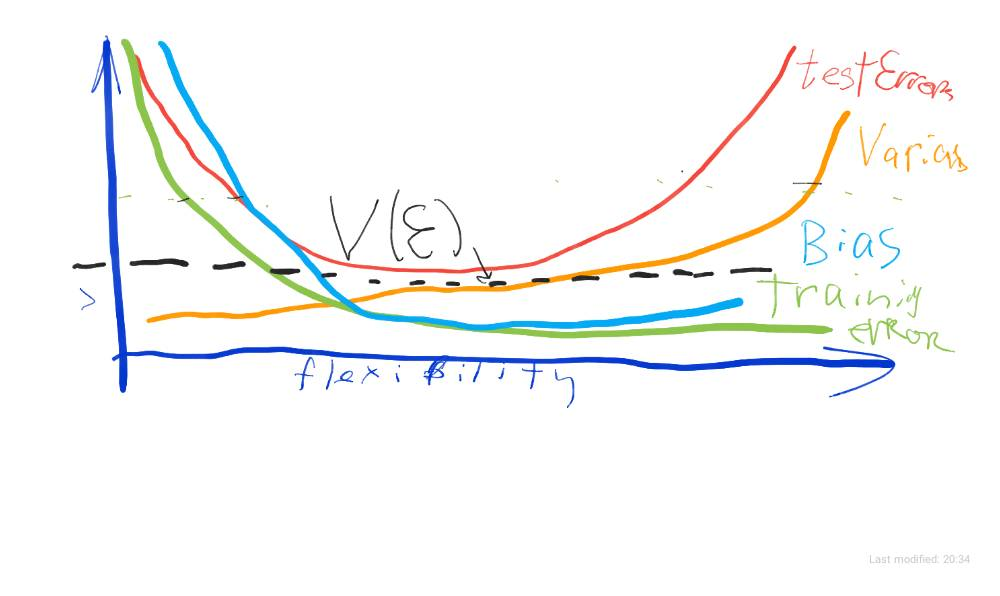

# Home work 1

@author: Igor Ostaptchenko igor_ost@wayne.edu AKA borodark@gmail.com

## 2.4 Excercises

### 1. For each of parts (a) through (d), indicate whether we would generally expect the performance of a flexible statistical learning method to be better or worse than an inflexible method. Justify your answer.

#### a) The sample size n is extremely large, and the number of predictors p is small.

Better! The flexible model will fit the data without overfiting, due to errors being minimized on the large number of observations.

#### b) The number of predictors p is extremely large, and the number of observations n is small.

Worse! A fewer data points will cause the overfit.

#### c) The relationship between the predictors and response is highly non-linear.

Better! The flexible model better expresses non-linearity in the data.

#### d) The variance of the error terms, i.e. σ2=Var(ϵ), is extremely high.

Worse! The flexible model will follow the noise/errors more precisely giving higher errors on different dataset.

### 2. Explain whether each scenario is a classification or regression problem, and indicate whether we are most interested in inference or prediction. Finally, provide n and p.

#### a) We collect a set of data on the top 500 firms in the US. For each firm we record profit, number of employees, industry and the CEO salary. We are interested in understanding which factors affect CEO salary.

- regression: the funtion of _Salary_ from _qianitative Profit_, _quanttative Number of Employees_, and _categorical Industry_ variables
- inference: the relationship between predictors in found parameters of fit
- *n*: 500
- *p*: 3

#### b) We are considering lauching a new product and wish to know whether it will be a success or a failure. We collect data on 20 similar products that were previously launched. For each product we have recorded whether it was a success or failure, price charged for the product, marketing budget, competition price, and the other variables.

- classification: find whether the product succeed or fail given the _price_, _marketing budget_, _etc_ ...
- prediction: measuring the probability of either for given values of the predictors
- *n*: 20
- *p*: 13

#### c) We are interesting in predicting the % change in the US dollar in relation to the weekly changes in the world stock markets. Hence we collect weekly data for all of 2012. For each week we record the % change in the dollar, the % change in the US market, the % change in the British Market, and the % change in the German market.

- regression: finding smooth function
- prediction: use the function to get outcome given the space of parameter values
- *n*: 52
- *p*: 5

### 3. We now revisit the bias-variance decomposition.

#### a) Provide a sketch of typical (squared) bias, variance, training error, test error, and Bayes (or irreducible) error curves, on a single plot, as we go from less flexible statistical learning methods towards more flexible approaches. The x-axis should represent the amount of flexibility in the method, and the y-axis should represent the values for each curve. There should be five curves. Make sure to label each one.

#### b) Explain why each of the five curves has the shape displayed in part (a).
- _training error_ declines as flexibility increases: the selected  _f_ curve able to follow the data closely
- _test error_ intially declines when lexibility increases, it stops to fall and passing the valley starts to increase again cause the overfited _f_ curve gives more erros on test data
- _irreducible error_ is a constant hence the line is passing below the _test erros_ curve: the expected _test erros_ will be greater than _Var(ε)_
- _bias_ decreases as the levels of flexibility creates more complex function that more precisely approximate the system but stopped being impacted at some point
- _variance_ increases slowly with higher levels of flexibility, then increases rapidly causing _test errors_ to rise

### 5. What are the advantages and disadvantages of a very flexible (versus a less flexible) approach for regression or classification? Under what circumstances might a more flexible approach be preferred to a less flexible approach? When might a less flexible approach be preferred?

Advantages: Produces less bias representing complex and non-linear systems.
Disadvantages: May overfits training data, have higher variance.

More flexible approachs have to be used to get the reasonable fit, espesially when data contains substantial non-linearity. The less flexible aproaches shall be used when the dataset has fewer observations, for more interpretability, for limiting the solution space to the linear system for computational power reasons.

### 6. Describe the differences between a parametric and a non-parametric statistical learning approach. What are the advantages of a parametric approach to regression or classification (as opposed to a non-parametric approach)? What are its disavantages?

The Parametric approach makes assumptions about the form the function: linear or polinomial, more or less flexible. The choice will be choice of minimun errors of a fitted function. This model based approach is called parametric approach. Linear/Logistical Regressions are among these. 

The non-parametric approach does not make assumptions of shape of functions. Instead we estimate the function which fits closely to the data. SVM and various spline method use non-parametric approach.

Advantages: 
- Parametric approach can fit any kind of data choosing wide range of functions
- can fit something with lower size of sample compared to Non-Parametric, where the bigger sample size is needed to achive comparable performance. 

Disadvantages:
- Parametric approach is prone to overfiting when too flexible model is selected during training, that leads to large test errors
- The errors will be higher for less flexible models with fewer parameters.
