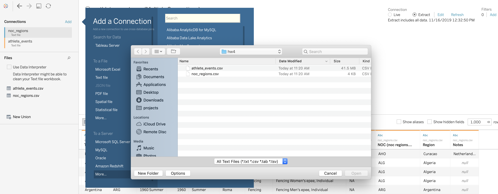
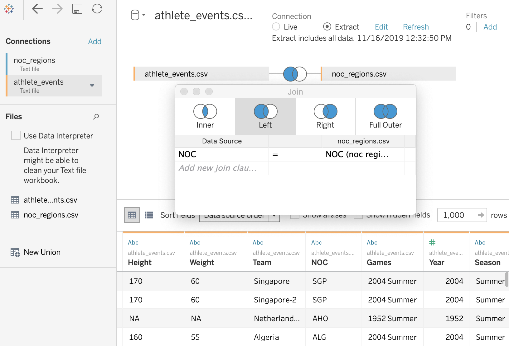
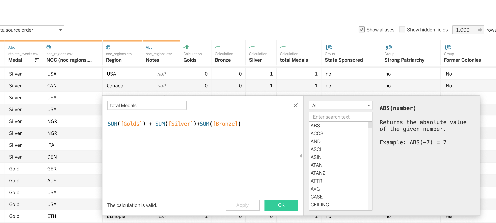
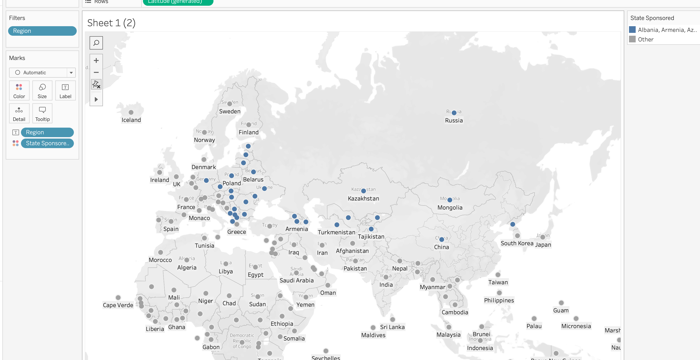
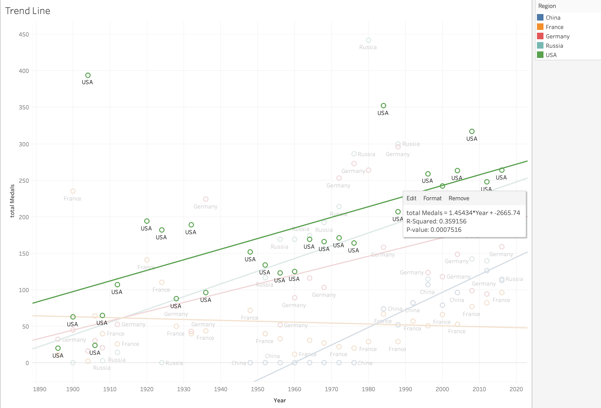
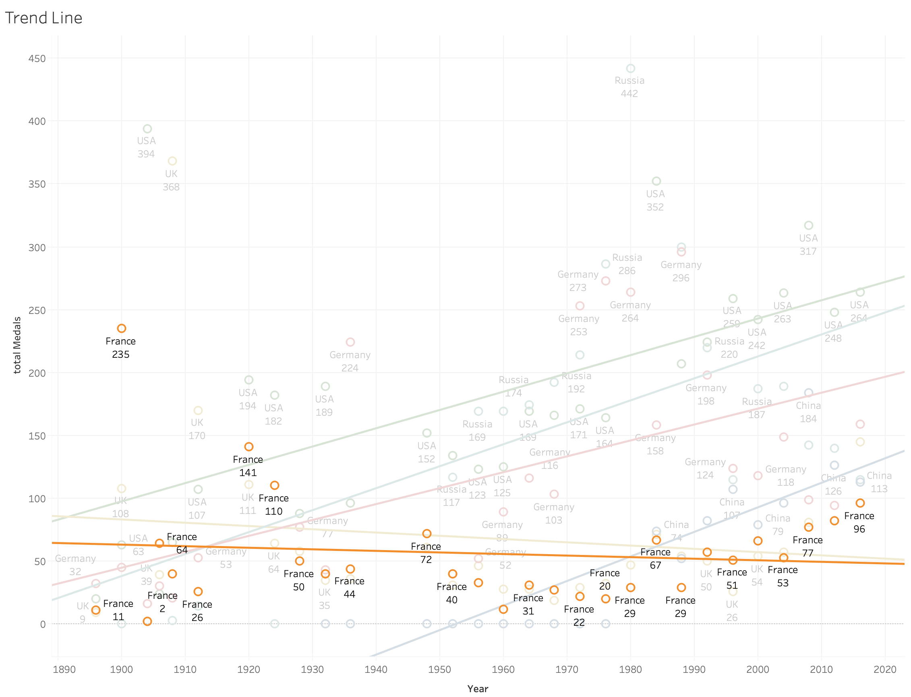
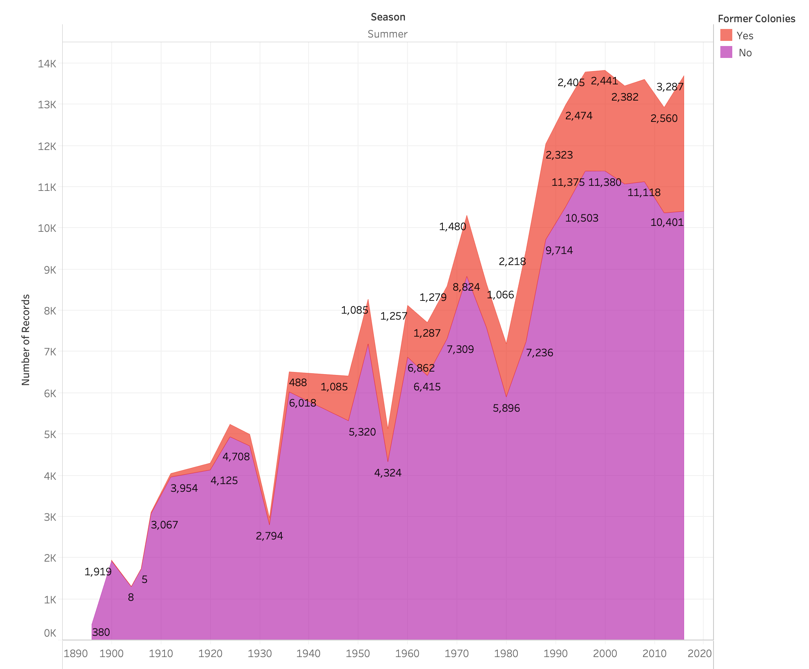
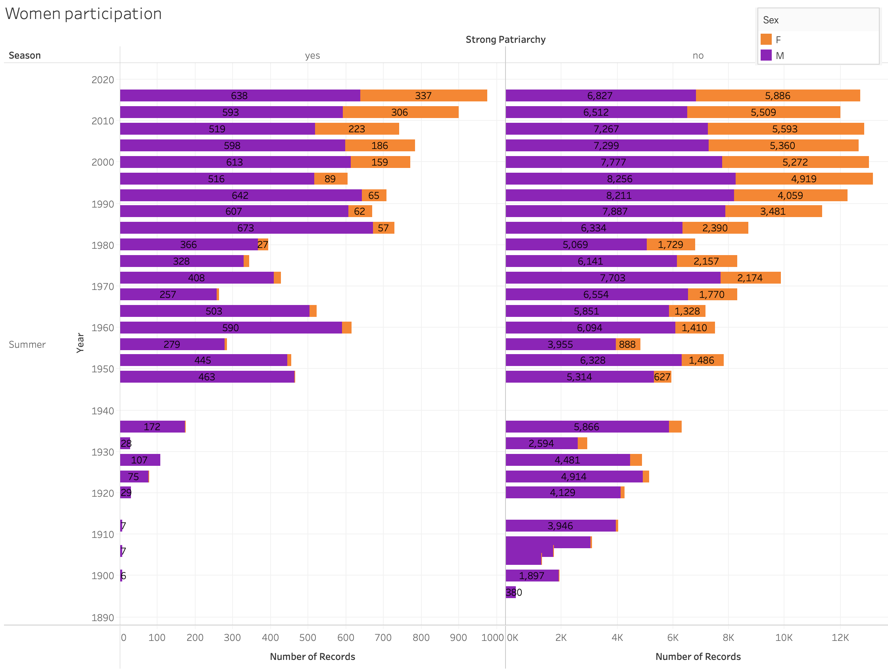
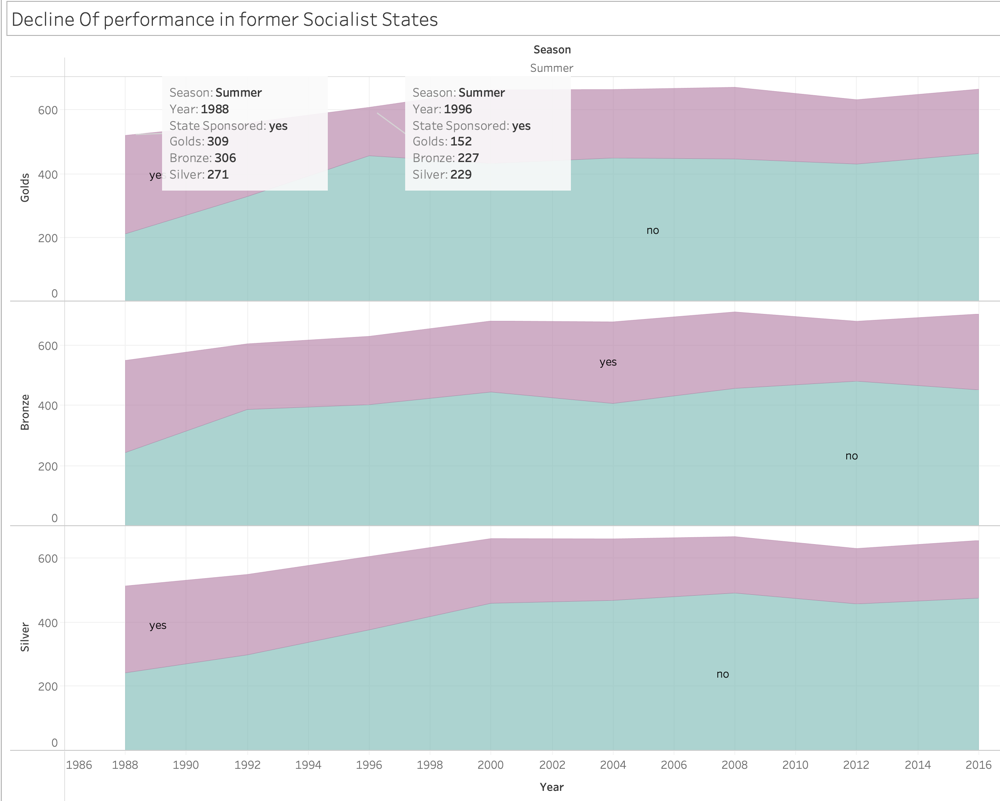

# HW4 TableauExercise

The Tableau assignment by Igor Ostaptchenko

## Connecting to Data Sources

Two CSVs provided 

Joining data sources  

## Data Preparation

Includes adding coluns and groupping countries.

* Added a count of `Gold`, `Silver`, and `Bronze` to each record to perform Agregations
  
* Group counties into:
  * Former _Colonies_ in Africa, Asia, Americas
  * Where `State Sponsorship` of athleats was a norm before 90th: `USSR`, `East Germany`, etc. I included `China` but I am not sure if it was a case there. 
  
  * Countries with strong `Patriarchic` cultural and religious heritage: `Middle East`, `North Africa`, `Arrabic Peninsula`, `Indonesia` etc

## Hightlights

### Decline of former Colonial powers

The trendline of `Total medals` shows grows in counties like `USA`, `Russia`, `China`, `Germany` but decline of `Great Britain` and `France` over the years.

* USA 

* France

Number of participans from former colonies grows but still at least 3 times less

### Participation of Women

There is a still clear distinction in ratio of men/women athleats participating in the games between countries with declared gender equality and counttries with oppressive traditions.

### The State Sponsorship

Several countries sponsored programms for the athleats preparation untill 90th. It had included training camps, housing and full payroll. The loss of the half of medal count between 1988 and 1996 shows impact of removing this resources from preparation process.

