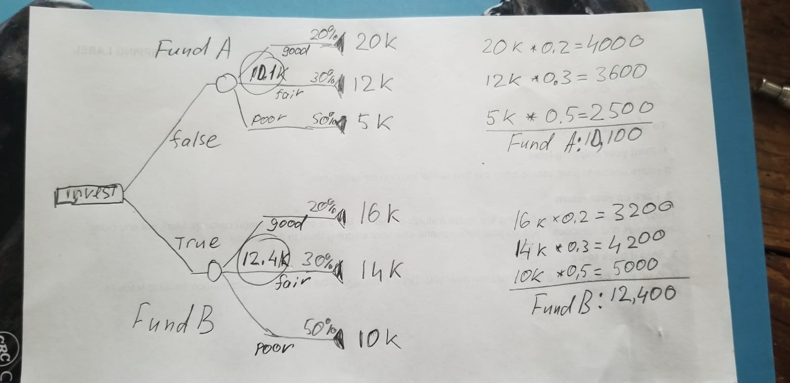

# Home Work #6 Schematic Tree and Decision Tree Analysis by Hand

## Q1

  The goal is to _maximize_ the *End Result*: the portfolio value after the investment.

  a)  
  
  b) The better choice is the `Fund B` - the expected value ot this branch 12.4K vs 11.1K for the `Fund A` branch.
  
  c) For the branches to be equal in case of _fund A in a good economy_ the amount of `2.3K` has to come from `Fund A -> Good Economy` branch. The value must be `2.3K` more then `4K` or `6.3K`. Given the branch has `20%` probability ahe absolute value must be `6.3K * 5` or `31.5K` so the return must be at least `21.5K` vs `10K` as originally stated.

## Q2

The goal is to maximize the EMV of `Winings Taken Home`

  a) The full tree starts from `Q1` and there is `75%` chance of having `$1000` after the first question. After the decision of `Answering the Question #2` the EMV is `$1000` for `NO`. The EMV is `1446` after applying the `2/3` probability of having `2200 = 1000 + 1200` in winings. To deside on `Answering the Question #3` or not let's compare `NO` that gives `2200` and `50%` chance of having `3700`: `2200 > 1850` hence by denying the answering the `Q3` we have `2200` of EMV. _If first two qiestions answered correctly there is no point in answering the Q3_

## Q3

The goal is to minmize the EMV of `Support cost per episode`

  a) 
  
  b) The assigment of `Group 1` specialist in the case where probability of him solving the problem is `75%` have EMV of `$35` vs `$40` if the `Group 1` takes it first. The `Group 1` has to handle this request.

  c) 
  
  d) The assigment of `Group 2` specialist in the case where probability of the `Group 1` specialist solving the problem is `55%` gives EMV of `$40` vs `$43` if done the other way.  The `Group 2` has to handle this request.

## Q4 

  a) The Probability of part to be scrapped is the same no matter what order the operations are performed. What is the probability that a part is ruined?
  
    * Probability of Success (1 – 0.1)(1 – 0.2) = %72 
    * Probability of Failure %100 - %72 = %28
  
  b) The EMV has the value of `-10` when `Lathe #2` starts and `-15` otherwise: `Lathe #2` has to start first.
  

  My hand drawings had incorrect calculations: I have assumed the loss of `$500` in cost of material per scrapped part is incurred and Value is -10
  Here is the proper tree:
  

  c) The `Lathe #2` has to start first.
