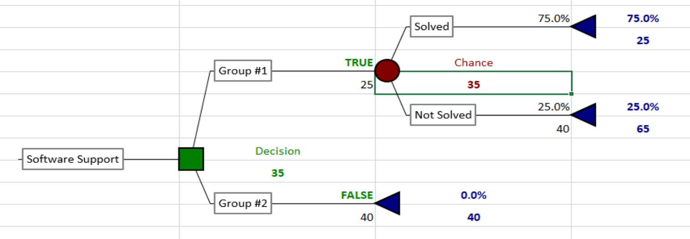
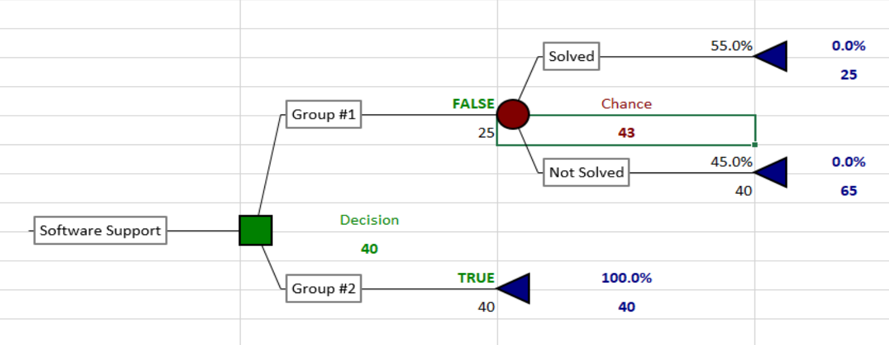
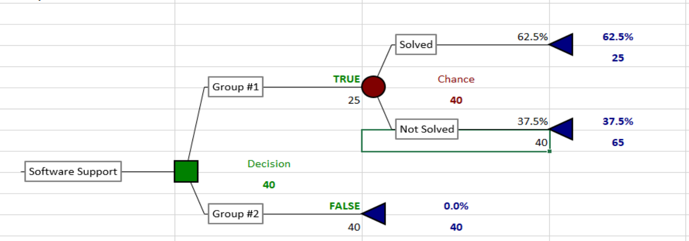
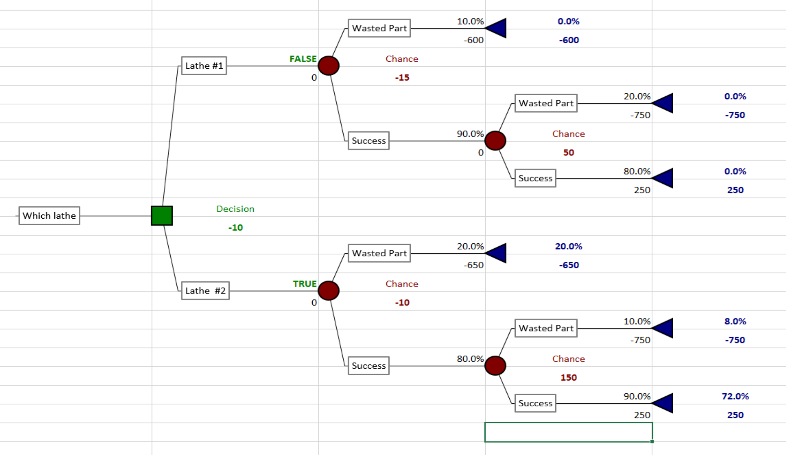
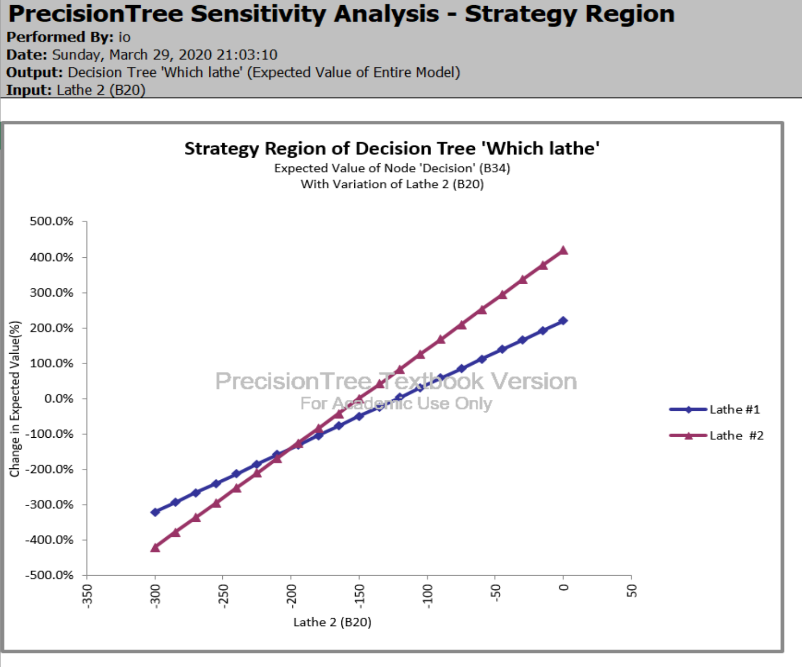

# Home Work #7 Schematic Tree and Decision Tree Analysis by Hand

## Q1

### Tree

### Optimal Path

### Sensitivity

The

### Cumulative Probability

### Spider

### Tornado

## Q2

The goal is to minmize the EMV of `Support cost per episode`

  a) 
  
  b) The assigment of `Group 1` specialist in the case where probability of him solving the problem is `75%` have EMV of `$35` vs `$40` if the `Group 1` takes it first. The `Group 1` has to handle this request.

  c) 
  
  d) The assigment of `Group 2` specialist in the case where probability of the `Group 1` specialist solving the problem is `55%` gives EMV of `$40` vs `$43` if done the other way.  The `Group 2` has to handle this request.

  e) If Probability of solving assigment by `Group 1` specialist is bellow `62.5%` the problem has to be assigned to `Group 2`
  
  

TODO 

## Q3 

###

###

