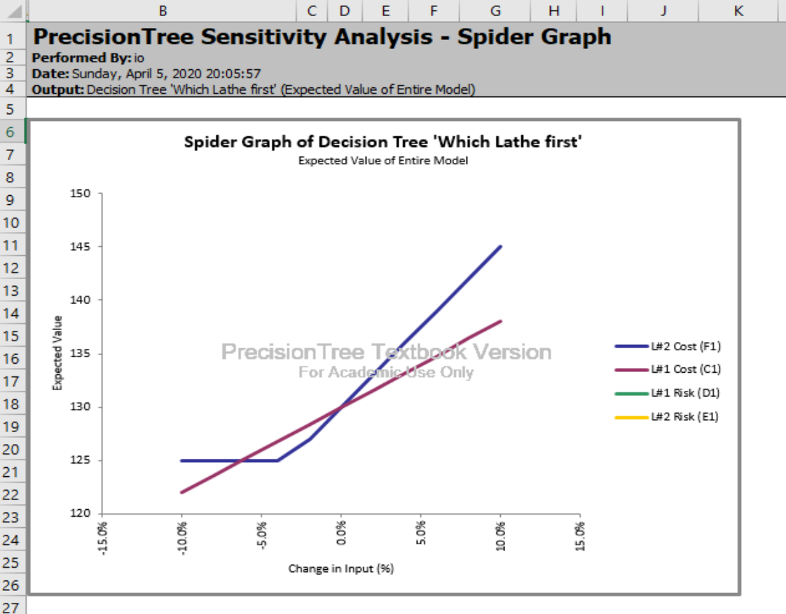
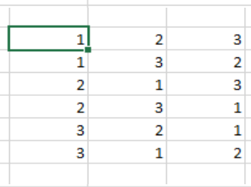

# Home Work #7 Schematic Tree and Decision Tree Analysis by Hand

## Q1

### Tree

### Optimal Path

### Sensitivity

The analysis is : until the value of the portfolio is `31.5K`, it is when the  return must be at least `21.5K` the `Fund B` is still the best option.

### Cumulative Probability

### Spider

### Tornado

### Conclusions

* For the `Fund A` investment to become more valuable in the `Good Economy` scenario the  return must be at least `21.5K`
* There is a `%50` risk of end up with `5000K` using `Fund A` strategy
* There is a `%50` risk of end up with `10000K` using `Fund B` strategy

## Q2

The goal is to minmize the EMV of `Support cost per episode`

  a) 
  
  b) The assigment of `Group 1` specialist in the case where probability of him solving the problem is `75%` have EMV of `$35` vs `$40` if the `Group 1` takes it first. The `Group 1` has to handle this request.

  c) 
  
  d) The assigment of `Group 2` specialist in the case where probability of the `Group 1` specialist solving the problem is `55%` gives EMV of `$40` vs `$43` if done the other way.  The `Group 2` has to handle this request.

  e) If Probability of solving assigment by `Group 1` specialist is bellow `62.5%` the problem has to be assigned to `Group 2`
  
  

### 11.6.a)
  

  

  

  
### 11.6.b) 

- The _highes impact_ is from `L#2 Cost`
- No impact from _Both_ `Risks` 

### 11.6.c)

- The highes _Rate of Change_ is the `L#2 Cost`

### 11.6.d and 11.6.e)

The *Expected Value of Perfect Information* is calculated by taking the pessimistic value and subtracting the optimistic value.

For given range of changes:

The *EVPI*s for both are as follows:

## Q3 

### a)
The Probability of part to be scrapped is the _same no matter what order the operations are performed_.
  * What is the probability of the part being ruined?
  
    * Probability of Success (1 – 0.1)(1 – 0.2) = %72 
    * Probability of Failure %100 - %72 = %28

### b) 

### c)  Conclusion: `Lathe #2` has to start first.

### d) The Total value encreases linearly with coefficient ~1 when cost of `L#2` operation drops

### 10.14.a) There is `3! = 3*2*1` or `six` possible permutations for the three machines.

### 10.14.b)
  
    * Probability of Success (1 – 0.1) * (1 – 0.2) * (1 - 0.25) = %54
    * Probability of Failure %100 - %54 = %46

### 10.14.c)

### 10.14.d)

The winning branch is `L#2 -> L#3 -> L#1`. The Value obtained is `62`. The second choice in the `L#3 -> L#1 -> L#2` =:= `59.5`. It is possible to schedule the processing this way too if needed for the situation. 

### 10.14.e)

For the pair-wise comparison one would build a table with 6 rows and calculate the value and select the maximum - the same calculations done during the Tree RollUp. 
Unfortunately the complexity grows very fast: it the function of `n!`!

### 10.14.f) 

There is `4! = 4*3*2*1` or 24 permutations for the four machines.

### Conclusions

* There impact of the processing cost for step performed by `Lathe#2` is the most significant for two-machines configuratiuon.
* Only two decisions needed for three-machines configuration.
* In some industries, like `Aviation/Space`, the loss of the part being scraped may significantly impact the Value: the complicated machining with high tolerances may bring the part costs to 100K range - this is most defenetely need to be taken into account in `real life` problems.
* The probability of `scrap` grows wth adding more steps to the processing.
* The fast increasing the number of possible permutations per added process impose some limit on the `tree` based models.
