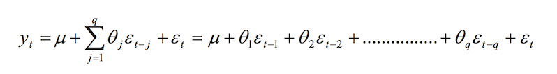

# Case study: Aproaches and Methods of anslysies of finsncial time serial data.

The application of quantitative methods in finance has greatly increased in recent years because of the data being collected and are available over internet, some data is free for other one have access after paying some fee. Data is being collected for many variables in a number of countries and at a finest timescale available. Computing resources are available in the forms of public cloud: AWS, Google Compute. The statistical packages for analyzing financial data are available for free as open source, for example: R. The availability threshold has lowered givig the possibility of application to a wider audience.
It is possible now to apply analysis and forecast the behaviour of market instruments cause the number of statisstical methods were developed in recent years. We'll review several methods and consider define critera to measure performance of differnt methods.

## Defenitions and components of Time Series
The ability to forecast a temporal sequence of data into the future is critical in many industries: finance, transportation and manufacturing are a few examples.
The time series is a set of data points, measured for a period time, can be defined as a set of vectors x(t),t = 0,1,2,... where t represents the time elapsed [2]. The variable x(t) is treated as a random variable. The measurements taken are arranged in a proper chronological order.
For example sizes and tollerences of parts produced by automated manufacturing equipment. It is important to observe the series to understand if equipment perform well to mitigate the potential of producing deffective parts and wasting raw material.
The array of [Open,High,Low,Close,Volume] combined with _Stock symbol_[IBM,AMZ,...] and a _Time Stamp_ in form of Minute, Day, Week of the year is typical representation of Stock market time series.
A time series containing records of one variable is termed as univariate. If observation  of more than one variable are considered are called the multivariate.
A time series can be continuous or discrete. The continuous time series have observations are measured at every instance of time: amount of fuel burned by engine or speed and direction of the wind at some geo location point is the example of continues time series. The discrete time series contains observations captured or recorded at discrete points of time: Weekly Return, Daily Log Return are examples of discrete time series. It is possible to trnsform continues time series into discrete usin Fourier transform [1].

### Stationarity
A time series is stationary when there is no systematic _Trend_, no _Systematic change in variance_ and no _Irregularity_ is observed, and seasonality does not exist.
A strictly stationary time series is one for which the probabilistic behavior of every collection of values:

**{xt1,xt2,...,xtk }**

is identical to that of the time shifted set. That is,

**{xt1+h,xt2+h,...,xtk+h}**

**Pr{xt1 ≤ c1,...,xtk ≤ck} = Pr{xt1+h ≤c1,...,xtk+h ≤ ck}**

_for all k =1,2,..., all time points t1,t2,...,tk, all numbers c1,c2,...,ck,and alltime shifts h = 0, ±1, ±2, ... ._ 

This definition also also implies that mean function of the series, μ , if exists, at any points _s_ and _t_, is constant for all _s_ and _t_, and hence μ must be constant. 

Most processes in nature appear to be non-stationary so strict stationarity is too strong of a definition, the assessment of strict stationarity from a single data set is not easy[1]. Rather than imposing conditions on all possible distributions of a time series, less strict version is used: conditions imposed only on the first two moments of the series.

The **weakly stationary time series**, xt , is a finite variance process such that 
 * the mean value function, **μt**  is constant and does not depend on time _t_
 * the autocovariance function, **γ(_s_, _t_)**, depends on **_s_** and **_t_** only through their difference **|_s_ − _t_|**.

The strong and weak stationarity does not imply each other. A weakly stationary process following normal distribution is strongly stationary. So the concept of stationarity is a mathematical idea constructed to simplify the theoretical and practical development of stochastic processes. To design a proper model, adequate for future forecasting, the underlying time series is expected to be stationary[2].

_Irregular_ variations in a time series are caused by unpredictable influences, that do not repeat in a particular pattern. These variations are caused by incidents like natural disasters, breakdown of equipment, sensor mulfuncions, abrupt changes in business environments like bancruptsies, firm collapses and global events influences the observed process. There is no statistical technique for measuring _Irregular_ fluctuations in a time series.

 
## Finansial Time Series Characteristics
The studies of financial time series mostly involve returns, instead of prices. For some investors, return of an asset is a simplest summary of the investment opportunity. Second, return series are easier to handle than price series because the returns have more attractive statistical properties[4].

### Asset returns

Let _Pt_ be the _price_ of an asset at time index _t_.

#### One-Period Simple Return

The asset beeing hold for one period from date t − 1 to date t would result in a _simple gross return_
* __1+Rt = Pt__  or  __Pt = Pt-1(1+Rt)__

The corresponding one-period _simple net return_ or _simple return_ is
* __Rt = (Pt/Pt−1) - 1 = (Pt - Pt−1)/Pt−1__

The formula is different if market a instrument has to pay dividends or coupon in case of bonds during analysed period.

#### Continuously Compounded Return
The natural logarithm of the simple gross return of an asset is called the continuously compounded return or log return:

* **rt** = ln( 1 + **Rt** ) = ln( **Pt / Pt−1**) = **pt** − **pt−1**

where **pt** = ln( **Pt** ). Continuously compounded returns **rt** have an advantage over the simple net returns *Rt* : _the multiperiod log return is the sum of continuously compounded one-period log returns_. Also according to [3] statistical properties of log returns are more tractable.

## ARIMA models

The Autoregressive Integrated Moving Average (ARIMA) Model is widely used method in Time series Forecasting. 

### AR

The Autoregressive models are based on the idea that the current value of the series, _xt_, can be explained as a function of _p_ past values, _xt−1_,_xt−2_,...,_xt−p_, where *p* determines the number of steps into the past needed to forecast the current value. The assumption is that value x depends only on past values, so we can say that it regresses on itself, hence the name - _autoregressive_.

An autoregressive model of order **p**, abbreviated **AR** ( _p_ ), according to [1]:

 * xt = φ1 * xt−1 + φ2 * xt−2 +···+φp * xt−p + wt <---- **(a)**
where xt is stationary, wt ∼ wn(0, σw2 ), and φ1, φ2, . . . , φp are constants (φp !=  0).

The mean of xt is zero. If the mean, μ, of xt is not zero, replace xt by xt − μ in **(a)** or write

xt − μ = φ1 * (xt-1 −μ)+φ2(xt-2 −μ)+···+φp * (xt-p −μ) + wt,

* x = α + φ1xt-1 +φ2xt-2 +···+φpxt-p +wt

where α = μ(1 − φ1 − · · · − φp).

### MA

MA(q) model uses past errors as the explanatory variables. The MA(q) model as per [2]:

Here _μ_ is the mean of the series, _θ_j (j=1,2,...,q) are the model parameters and _q_ is the order of the model. 

### ARIMA 
To remove non-stationarity the finite differencing is applied to the data points [8]. The ARIMA(_p_,_d_,_q_) as defined in [2] has:

* _p_, _d_ and _q_ are integers greater than or equal to zero and are respectively the orders of the autoregressive, integrated, and moving average components of the model.
* The integer _d_ controls the level of differencing. When _d_ = 0, then it reduces to an ARMA(_p_,_q_) model.
* ARIMA(_p_,0,0) is the AR(_p_) model 
* ARIMA(0,0,_q_) is the MA(_q_) model.
* ARIMA(0,1,0), when yt = yt−1 +εt, becomes the _Random Walk_ model [2].

## Box-Jenkins Methodology for ARIMA models

The methodology for selecting (_p_,_d_,_q_) parameters involves steps outlined bellow. It is an iterative aproach where results can be also be crossvalidated with other models like _SVM._

 1. Postulate a general class of ARIMA model
 2. Identify the model, which can be tentatively entertained
 3. Estimate parameters in the tentatively entertained model
 4. Diagnosis Checking: Is the model adequate? YES: do _5_. NO: do _2_.
 5. Use this model to generate forecast

## SVM application to time series analisys

The theory of Support Vector Machines was develop by applied mathematitions from Soviet Union: Vapnik, Chervonenkis and others [2]. Vapnik later worked in Bell Labs. The SVM differs from other methods besause there are no probabalistic concepts employed: it feels like typical Computer Sciense take on the problem of classification. The classification method in financial time series analisys can be used if we consider that problem can be formulated the following way: given the history of financial instrument perdict the direction - will it be up or down. The _Up_ or _Down_ becomes categorical variables and a classification methods can be used.

To find the hyperplane separating two classes the input space shall be mapped nonlinery into a higher dimensional feature space. Because of this the quality and complexity of SVM solution does not depend directly on the input space [2].
The training process is solving a linearly constrained quadratic programming problem. The SVM solution is always unique and globally optimal. But the large training set requires an enormous amount of computatative power because of the increased time complexity of the solution [2].

The [2] includes SVM into set of Time Series forecasting indespensible in cross - validations with other forecasting methods.

The [7] concludes that SVM model achives better forecasting accuracy in terms of different evaluation measure during the validation phase during both the training phase and the validation phase.

## Deep learning and neural networks application

Deep learning neural networks characterized by these three relevant capabilities [2]:
* support multiple inputs and outputs
* capable of learning the arbitrary mappings of inputs to outputs
* able to automatically extract patterns in inputs that spans over long sequences

The use of Neural networks for time series forecasting helps to remove manual feature engineering, data scaling, and differencing to make the data stationary.
The Recurrent Neural Networks applyed to time series related tasks like language modeling and machine translation were succesful but RNN are difficult to train: during back propagation, recurrent neural networks suffer from the vanishing gradient problem. The vanishing gradient problem is when the gradient shrinks as it back propagates through time. The evolutions of this aproach are Long Short-Term Memory (LSTM) and Gated Recurrent Units (GRU). The LSTM and GRU offers the solution to short-term memory in the form of gates that can regulate the flow of information and can learn which data in a sequence is important to keep or throw away passing only relevant information down the chain of sequences of makeing predictions. 
The succesfull applications of Convolutional Neural Networks and specifically new Temporal Convolutional Networks Architecture to analisys of video streams described in [6]. The article provides an empirical evidense that TCN exhibits longer memory compared to recurrent architectures with the same capacity and outperforms generic recurrent architectures such as LSTMs and GRUs. But how one would compare the performance of many forecasts?

## Measure of performance of the forecasts

There are number of important measures for judging forecast accuracy of the fitted model. Each has some unique properties. Conducting experiments one must consider more than one performance criteria to obtain key error components: amount, magnitude and direction. This will give an alternative opinion on the key components of overall forecast error.
Please refer to [2] for formulas for each measure and let's consider important properties of each measure.

* Mean Forecast Error (MFE)
  * Measure of the average deviation of forecasted values from actual ones
  * when MFE close to 0 one have a good forecast with minimum bias 
* Mean Absolute Error (MAE)
  * Measures the average absolute deviation of forecasted values from original ones, AKA as the Mean Absolute Deviation (MAD)
  * Good forecast should have smallest possible MAE
  * Shows the magnitude of overall error, occurred due to forecasting
* Mean Absolute Percentage Error (MAPE)
  * Represents the percentage of average absolute error occurred  
* Mean Percentage Error (MPE)
  * Shows the percentage of average error occurred
  * Good forecast's MPE should be small
* Mean Squared Error (MSE)
  * Measures an average squared deviation of forecasted values
  * Gives an overall idea about errors
  * Not as intuitive and easily interpretable as the other measures
* Sum of Squared Error (SSE)
  * Measures the total squared deviation of forecasted observations from the actual values
* Signed Mean Squared Error (SMSE)
  * Same as MSE, except that the original sign of error is kept
* Root Mean Squared Error (RMSE)
  * the square root of calculated MSE
* Normalized Mean Squared Error (NMSE)
  * Normalizes the obtained MSE after dividing it by the test variance
  * Balanced error measure effective in judging forecast accuracy of a model
  * Smaller the NMSE value better the forecast
* Theil’s U-statistics (TU-s)
  * Values are between 0 ≤ U≤ 1; U=0 means a perfect fit.
  * For assessing good forecast accuracy, it is desirable that the U-statistic is close to zero.

| Measure/properties                      | MFE | MAE | MAPE | MPE | MSE | SSE | SMSE | RMSE | NMSE | TU-s |   |
| :--                                     | --  | --  | ---  | --  | --- | --- | ---  | ---  | ---  | ---  |   |
| shows error direction                   | +   | -   | -    | +   | -   | -   | +    | -    | -    | -    |   |
| penalize extreme errors                 | -   | -   | -    | -   | +   | +   | +    | +    | +    | -    |   |
| positive and negative errors cancel out | +   | -   | -    | +   | -   | -   | +    | -    | -    | -    |   |
| depends on the scale of measurement     | +   | +   | +    | +   | +   | +   | +    | +    | +    | +    |   |
| affected by data transformation         | +   | +   | +    | +   | +   | +   | +    | +    | +    | +    |   |

Any time series analysis have to use more then one performance verification to make sure selected model is adequate.

## Applied analysis with R and python: libraries available
The `R` is the open source functional language used in statistical programming ecosystem containing many Statistical Learning methods implementations. It is available for Windows, Linux, FreeBSD, Mac OSX and can be compiled  The power of `R` is in the wast number of libraries containing real and simulated datasets and functions. The general functions can manipulate datasets and draw plots. The statistical model fit and analysis functions provide ability to fit models and gage the errors and model fit parameters. The loops and other constructs allow to build complex data driven applications. To follow Box Jenkins Methodology the programming system has to iterate over several methods, compare the performance results and recommend severa leading models. This all can be done in one `R` programm. However `R` has it's own limitaions and the most important is the one related to the fact that `R` runtime has to fit all initial, intermediate and resulting data in a memory of the single computer system. It may not always be possible because of the size of the dataset.

### ARIMA

### SVM

### ANN

## The plan for Log return analisys of daily time series in the Course Project

## Literature

[1] Robert H. Shumway David S. Stoffer, Time Series Analysis and Its Applications With R Examples, Fourth Edition
[2] Ratnadip Adhikari R. K. Agrawal, An Introductory Study on Time Series Modeling and Forecasting
[3] Analysis of Financial Time Series, Financial Econometrics, RUEY S. TSAY University of Chicago
[4] Tsay, Ruey S., An introduction to analysis of financial data with R/Ruey S. Tsay. p. cm. Includes index. ISBN 978-0-470-89081-3
[5] An Empirical Evaluation of Generic Convolutional and Recurrent Networks for Sequence Modeling, Shaojie Bai, J. Zico Kolter, Vladlen Koltun
[6] Temporal Convolutional Networks: A Unified Approach to Action Segmentation by Colin Lea Rene ́ Vidal Austin Reiter Gregory D. Hager, Johns Hopkins University
[7] A comparison of performance of several artificial intelligence methods for forecasting monthly discharge time series by Wen-Chuan Wang, Kwok-Wing Chau, Chun-Tian Cheng, Lin Qiu, Journal of Hydrology, Vol. 374, No. 3-4, 2009, pp 294–306
[8] https://people.duke.edu/~rnau/411diff.htm
