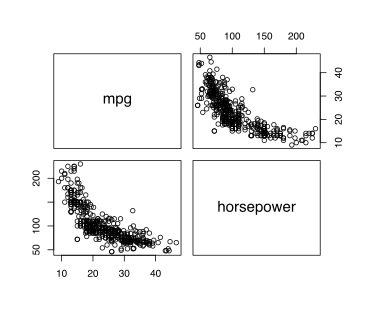
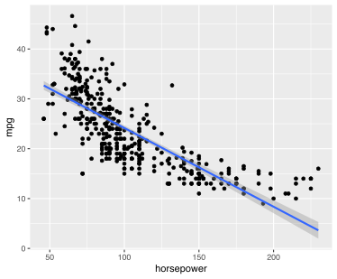
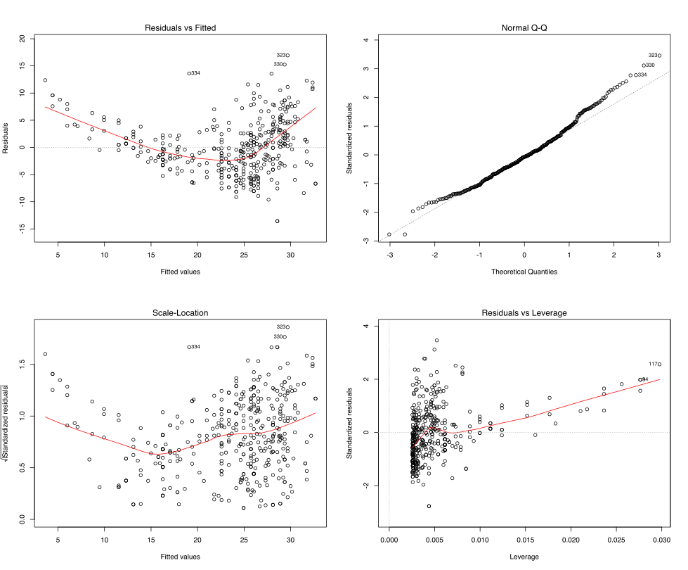
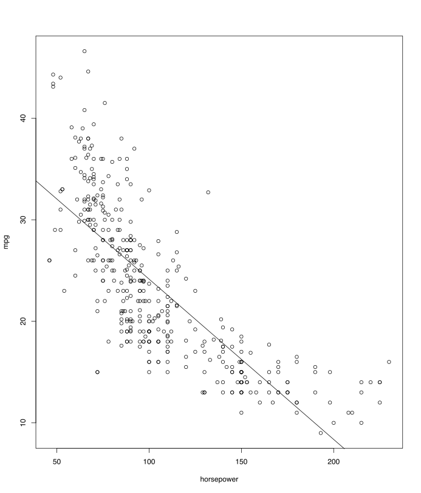
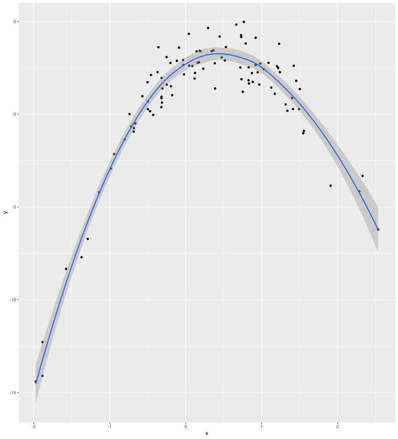
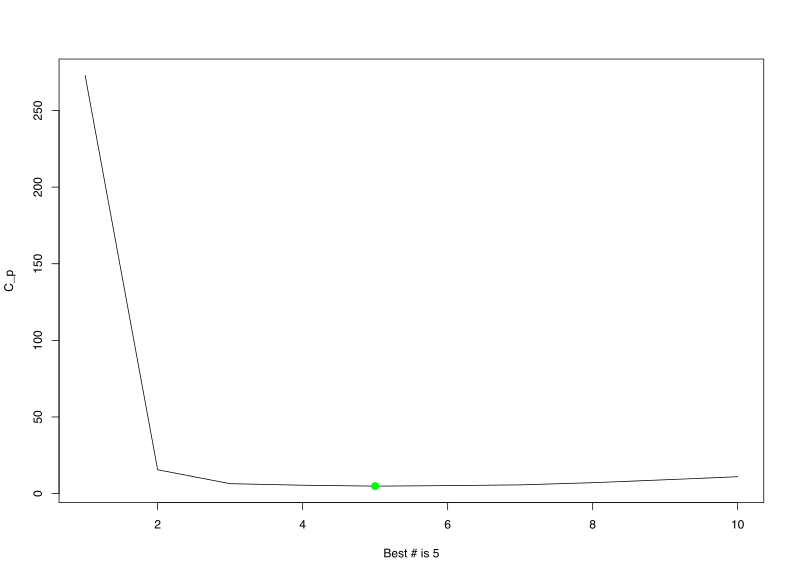
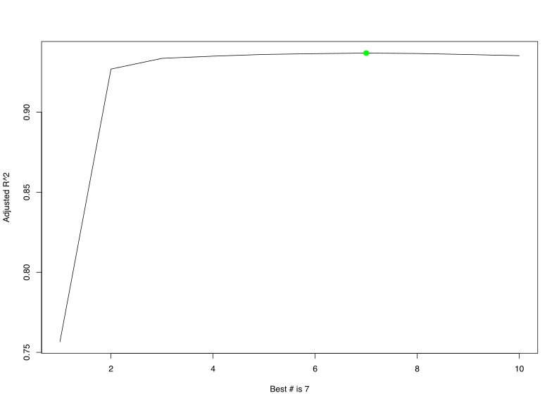
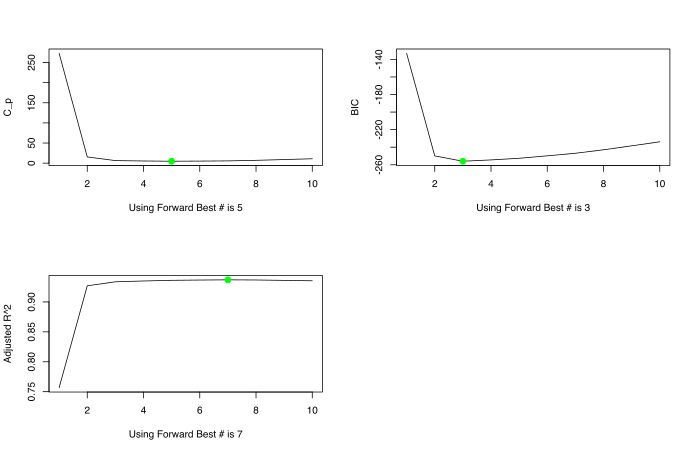

# Home work 1

## 1. Please use the lm() function to perform a simple linear regression with mpg as the response and horsepower as the predictor

```R
library (ISLR)
Auto=read.table ("Auto.data", header =T,na.strings ="?")
attach(Auto)
names(Auto)
```
Output:
```
[1] "mpg"          "cylinders"    "displacement"
[4] "horsepower"   "weight"       "acceleration"
[7] "year"         "origin"       "name"
```

There is a negative potentialy non-linear relationsip between `horsepower` and `mpg` (miles per gallon) according to visual analisys.

```R
pairs(~ mpg + horsepower, Auto)
```




### Simple linear regression with mpg as the response and horsepower as the predictor

```R
lm.fit =lm(mpg~horsepower ,data=Auto,subset=train)
summary(lm.fit)
```


```
Call:
lm(formula = mpg ~ horsepower, data = Auto, subset = train)

Residuals:
     Min       1Q   Median       3Q      Max 
-13.9927  -3.3274  -0.3231   2.8258  16.5115 

Coefficients:
             Estimate Std. Error t value Pr(>|t|)    
(Intercept) 40.263828   0.982438   40.98   <2e-16 ***
horsepower  -0.156543   0.008742  -17.91   <2e-16 ***
---
Signif. codes:  0 ‘***’ 0.001 ‘**’ 0.01 ‘*’ 0.05 ‘.’ 0.1 ‘ ’ 1

Residual standard error: 5.028 on 194 degrees of freedom
Multiple R-squared:  0.6231,	Adjusted R-squared:  0.6211 
F-statistic: 320.7 on 1 and 194 DF,  p-value: < 2.2e-16
```
### a. Is there a relationship between the predictor and the response?

The p-value corresponding to the F-statistic is less then 2.2e-16, this indicates a relationship exists between “mpg” and “horsepower”.


### b. How strong is the relationship between the predictor and the response?

The relationship is strong: 
* R-squared is 0.6211  meaning that 62.11% of the variability in `mpg` can be explained by `horsepower``


### c. Is the relationship between the predictor and the response positive or negative?

The relationship is `Negative`: the slope is `-0.156543`
```
horsepower  -0.156543
```

### d. What is the predicted mpg associated with a horsepower of 98?

`24.46708`

#### d.1 What are the associated 95% confidence intervals?
```R
predict (lm.fit, level = 0.95, data.frame(horsepower=98 ), interval ="confidence")
```
Outputs:
```
fit      lwr      upr
1 24.46708 23.97308 24.96108
```
#### d.2 What are the associated 95% prediction intervals?
```R
predict(lm.fit, level = 0.95, data.frame(horsepower = 98), interval = "prediction")
```
Outputs:
```
fit     lwr      upr
1 24.46708 14.8094 34.12476

```
### Fitted Model



### Fit parameters



### e. Plot the response and the predictor. Please use the abline() function to display the least squares regression line.
```R
plot(horsepower ,mpg, col="blue")
abline (lm.fit, col="green")
```


## 2. This question should be answered using the Carseats data set 

### a. Fit a multiple regression model to predict Sales using Price, Urban, and US.
```R
data(Carseats)
fit <- lm(Sales ~ Price + Urban + US, data = Carseats)
summary(fit)
```
Outcome:
```
Call:
lm(formula = Sales ~ Price + Urban + US, data = Carseats)

Residuals:
    Min      1Q  Median      3Q     Max 
-6.9206 -1.6220 -0.0564  1.5786  7.0581 

Coefficients:
             Estimate Std. Error t value Pr(>|t|)    
(Intercept) 13.043469   0.651012  20.036  < 2e-16 ***
Price       -0.054459   0.005242 -10.389  < 2e-16 ***
UrbanYes    -0.021916   0.271650  -0.081    0.936    
USYes        1.200573   0.259042   4.635 4.86e-06 ***
---
Signif. codes:  0 ‘***’ 0.001 ‘**’ 0.01 ‘*’ 0.05 ‘.’ 0.1 ‘ ’ 1

Residual standard error: 2.472 on 396 degrees of freedom
Multiple R-squared:  0.2393,	Adjusted R-squared:  0.2335 
F-statistic: 41.52 on 3 and 396 DF,  p-value: < 2.2e-16
```
### b. Provide an interpretation of each coefficient in the model. Some of the variables in the model are qualitative.

```R
?Carseats
```
```
Carseats {ISLR}	R Documentation
Sales of Child Car Seats

Description

A simulated data set containing sales of child car seats at 400 different stores.
...
Sales
Unit sales (in thousands) at each location
...

```
Because the Sales values are recorder in Thousands the following conclusions can be drawn: 

```
Price       -0.054459   0.005242 -10.389  < 2e-16 ***
UrbanYes    -0.021916   0.271650  -0.081    0.936
USYes        1.200573   0.259042   4.635 4.86e-06 ***
```

* The `Price` coefficient has a negative relationship with `Sales`. A dollar of a price increase predicts 54.459 less units to be sold. 
* The `Urban` has a very high p-value, so it doesn’t prove any evidence of relevance for Sales.
* The `US` factor indicates a strong influence in the model and assigns more 1.2 thousands sales units for each US location.

### c. Write out the model in equation form, being careful to handle the qualitative variables properly.

Let's explore the representation of qualitative factors in the model
```R
str(data.frame(Price, Urban, US))
```

The `Yes` and `No` values for model variables `UrbanYes` and `USYes` encoded respectinely as `2 and 1`

```
'data.frame':	400 obs. of  3 variables:
 $ Price: num  120 83 80 97 128 72 108 120 124 124 ...
 $ Urban: Factor w/ 2 levels "No","Yes": 2 2 2 2 2 1 2 2 1 1 ...
 $ US   : Factor w/ 2 levels "No","Yes": 2 2 2 2 1 2 1 2 1 2 ...
```
The equation of the model is:
```
Sales = (Price X -0.054459) + (UrbanYes X -0.021916) + (USYes X 1.200573)
```


### d. For which of the predictors can you reject the null hypothesis H0 : ßj = 0
```
UrbanYes    -0.021916   0.271650  -0.081    0.936
```


## 3. In this exercise you will generate simulated data and perform feature selection.
### (a) Use the rnorm() function to generate a predictor _X_ of length 100 , as well as a noise vector _Yn_ of length n=100 .

```R
x = rnorm(100)
Yn = rnorm(100)
```
Outputs:
```
> summary(x)
    Min.  1st Qu.   Median     Mean  3rd Qu.     Max. 
-2.09923 -0.79307  0.12273  0.03081  0.75102  2.11007 

> summary(Yn)
    Min.  1st Qu.   Median     Mean  3rd Qu.     Max. 
-2.72017 -0.46211  0.06884  0.14745  0.73142  2.88842 
```

### (b) Generate a response vector Y of length n =100 according to the model

`Y = ß0 + ß1 * X + ß2 * X^2 + ß3 * X^3 + Yn`

Where:
`ß0 = 3 ß1 = 2 ß2 = -3 ß3 = 0.30`

Note you will need to use the data.frame() function to create a single data set containing both X and Y .

```R
y = 3 + 2 * x - 3*x^2 + 0.3 * x^3 + Yn
require(leaps)
df <- data.frame(y, x)
ggplot(data = df, mapping = aes(x = x, y = y)) + geom_point() + geom_smooth(method = 'loess')

```



### (c) Use the regsubsets() function to perform best subset selection in order to choose the best model containing the predictors X1,X2,...,X10. 

From R library documentation on `leaps``
```
leaps {leaps}	R Documentation
all-subsets regressiom

Description

leaps() performs an exhaustive search for the best subsets of the variables in x for predicting y in linear regression, using an efficient branch-and-bound algorithm. It is a compatibility wrapper for regsubsets does the same thing better.

```
Doing the fit:

```R
fit <- regsubsets(y ~ poly(x, 10), data = df, nvmax = 10)
fit_summary <- summary(fit)
```
Outcome:
```
Subset selection object
Call: regsubsets.formula(y ~ poly(x, 10), data = df, nvmax = 10)
10 Variables  (and intercept)
              Forced in Forced out
poly(x, 10)1      FALSE      FALSE
poly(x, 10)2      FALSE      FALSE
poly(x, 10)3      FALSE      FALSE
poly(x, 10)4      FALSE      FALSE
poly(x, 10)5      FALSE      FALSE
poly(x, 10)6      FALSE      FALSE
poly(x, 10)7      FALSE      FALSE
poly(x, 10)8      FALSE      FALSE
poly(x, 10)9      FALSE      FALSE
poly(x, 10)10     FALSE      FALSE
1 subsets of each size up to 10
Selection Algorithm: exhaustive
          poly(x, 10)1 poly(x, 10)2 poly(x, 10)3 poly(x, 10)4 poly(x, 10)5 poly(x, 10)6 poly(x, 10)7 poly(x, 10)8 poly(x, 10)9 poly(x, 10)10
1  ( 1 )  " "          "*"          " "          " "          " "          " "          " "          " "          " "          " "          
2  ( 1 )  "*"          "*"          " "          " "          " "          " "          " "          " "          " "          " "          
3  ( 1 )  "*"          "*"          "*"          " "          " "          " "          " "          " "          " "          " "          
4  ( 1 )  "*"          "*"          "*"          " "          " "          " "          " "          " "          " "          "*"          
5  ( 1 )  "*"          "*"          "*"          " "          " "          " "          " "          "*"          " "          "*"          
6  ( 1 )  "*"          "*"          "*"          "*"          " "          " "          " "          "*"          " "          "*"          
7  ( 1 )  "*"          "*"          "*"          "*"          " "          " "          " "          "*"          "*"          "*"          
8  ( 1 )  "*"          "*"          "*"          "*"          " "          "*"          " "          "*"          "*"          "*"          
9  ( 1 )  "*"          "*"          "*"          "*"          " "          "*"          "*"          "*"          "*"          "*"          
10  ( 1 ) "*"          "*"          "*"          "*"          "*"          "*"          "*"          "*"          "*"          "*"
```
#### What is the best model obtained according to Cp, BIC, and adjusted R2?  Show some plots to provide evidence for your answer and report the coefficients of the best model obtained.

##### C_p
Let's see selected coefficients for C_p:

```
> coef(fit, which.min(fit_summary$cp))
  (Intercept)  poly(x, 10)1  poly(x, 10)2  poly(x, 10)3  poly(x, 10)8 poly(x, 10)10 
    0.8418354    14.8863446   -31.5099343     3.0770032    -1.4883429    -1.6032467 
```

```R
plot(fit_summary$cp, xlab = str_c("Best # is ",which.min(fit_summary$cp)), ylab = "C_p", type = "l")
points(which.min(fit_summary$cp), fit_summary$cp[which.min(fit_summary$cp)], col = "green", cex = 2, pch = 20)
```


##### BIC
Let's see selected coefficients for BIC:
```
> coef(fit, which.min(fit_summary$bic))

(Intercept) poly(x, 10)1 poly(x, 10)2 poly(x, 10)3 
   0.8418354   14.8863446  -31.5099343    3.0770032 
```

```R
plot(fit_summary$bic, xlab = str_c("Best # is ", which.min(fit_summary$bic)) , ylab = "BIC", type = "l")
points(which.min(fit_summary$bic), fit_summary$bic[which.min(fit_summary$bic)], col = "green", cex = 2, pch = 20)
```


##### Adjusted R^2
Let's see about selected coefficients:
```
> coef(fit, which.max(fit_summary$adjr2))

(Intercept)  poly(x, 10)1  poly(x, 10)2  poly(x, 10)3  poly(x, 10)4  poly(x, 10)8  poly(x, 10)9 poly(x, 10)10 
    0.8418354    14.8863446   -31.5099343     3.0770032     1.1924927    -1.4883429    -1.1378195    -1.6032467 
```

```R
plot(fit_summary$adjr2, xlab = str_c("Best # is ", which.max(fit_summary$adjr2)), ylab = "Adjusted R^2", type = "l")
points(which.max(fit_summary$adjr2), fit_summary$adjr2[which.max(fit_summary$adjr2)], col = "green", cex = 2, pch = 20)
```


### d. Please repeat c., using forward stepwise selection and using backwards stepwise selection. How does your answer compare to the results in (c)?
```R
fit_fw <- regsubsets(y ~ poly(x, 10), data = df, nvmax = 10, method = "forward")
fit_fw_summary <- summary(fit_fw)
fit_fw_summary
par(mfrow=c(2,2))
plot(fit_fw_summary$cp, xlab = str_c("Using Forward Best # is ",which.min(fit_fw_summary$cp)), ylab = "C_p", type = "l")
points(which.min(fit_fw_summary$cp), fit_fw_summary$cp[which.min(fit_fw_summary$cp)], col = "green", cex = 2, pch = 20)
plot(fit_fw_summary$bic, xlab = str_c("Using Forward Best # is ", which.min(fit_fw_summary$bic)) , ylab = "BIC", type = "l")
points(which.min(fit_fw_summary$bic), fit_fw_summary$bic[which.min(fit_fw_summary$bic)], col = "green", cex = 2, pch = 20)
plot(fit_fw_summary$adjr2, xlab = str_c("Using Forward Best # is ", which.max(fit_fw_summary$adjr2)), ylab = "Adjusted R^2", type = "l")
points(which.max(fit_fw_summary$adjr2), fit_fw_summary$adjr2[which.max(fit_fw_summary$adjr2)], col = "green", cex = 2, pch = 20)
```
Results are the same for forward. 


```R
fit_bw <- regsubsets(y ~ poly(x, 10), data = df, nvmax = 10, method = "backward")
fit_bw_summary <- summary(fit_bw)
fit_bw_summary
par(mfrow=c(2,2))
plot(fit_bw_summary$cp, xlab = str_c("Using Backward Best # is ",which.min(fit_bw_summary$cp)), ylab = "C_p", type = "l")
points(which.min(fit_bw_summary$cp), fit_bw_summary$cp[which.min(fit_bw_summary$cp)], col = "green", cex = 2, pch = 20)
coef(fit, which.min(fit_bw_summary$cp))
plot(fit_bw_summary$bic, xlab = str_c("Using Backward Best # is ", which.min(fit_bw_summary$bic)) , ylab = "BIC", type = "l")
points(which.min(fit_bw_summary$bic), fit_bw_summary$bic[which.min(fit_bw_summary$bic)], col = "green", cex = 2, pch = 20)
coef(fit, which.min(fit_bw_summary$bic))
plot(fit_bw_summary$adjr2, xlab = str_c("Using Backward Best # is ", which.max(fit_bw_summary$adjr2)), ylab = "Adjusted R^2", type = "l")
points(which.max(fit_bw_summary$adjr2), fit_bw_summary$adjr2[which.max(fit_bw_summary$adjr2)], col = "green", cex = 2, pch = 20)
```

Results are the same for backward. 


## 4. Please answer the following parts based on generated simulated data in question 3


