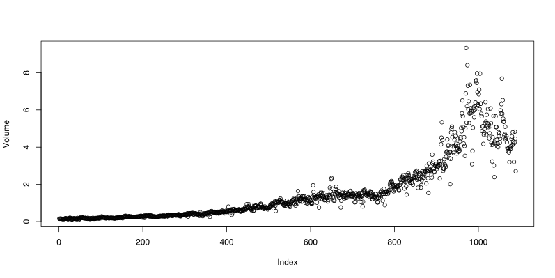
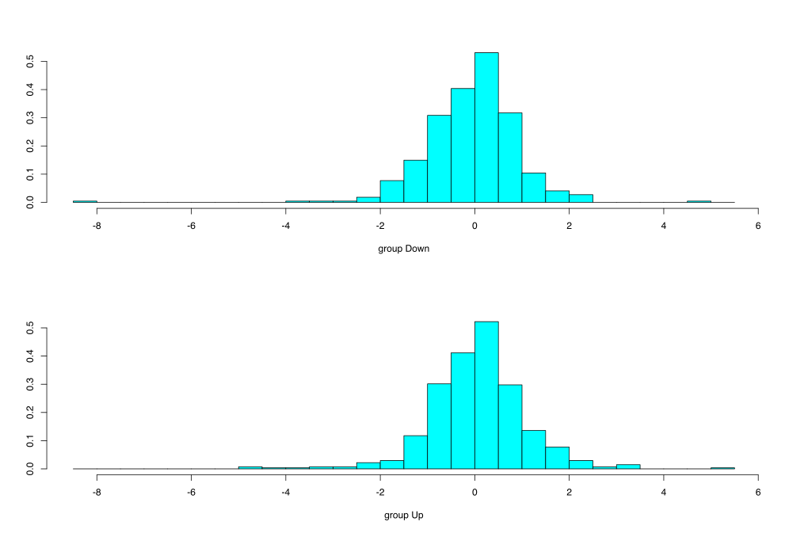
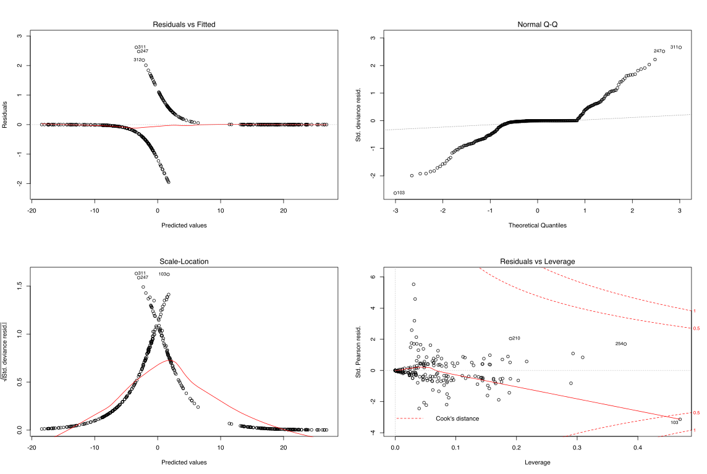
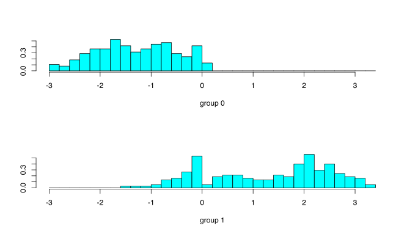

# Home Work 2

The `R` source for this report is here: [hw2.R](hw2.R)

## 1. Question #10 from chapter 4

This question should be answered using the Weekly data set, which is part of the ISLR package. This data is similar in nature to the Smarket data from this chapter’s lab, except that it contains 1089 weekly returns for 21 years, from the beginning of 1990 to the end of 2010.
```R
> library (ISLR)
> names(Weekly)
[1] "Year"      "Lag1"      "Lag2"      "Lag3"      "Lag4"      "Lag5"      "Volume"    "Today"     "Direction"

```
### (a) Produce some numerical and graphical summaries of the Weekly data. Do there appear to be any patterns?
```R
> summary (Weekly)
      Year           Lag1               Lag2               Lag3               Lag4               Lag5         
 Min.   :1990   Min.   :-18.1950   Min.   :-18.1950   Min.   :-18.1950   Min.   :-18.1950   Min.   :-18.1950  
 1st Qu.:1995   1st Qu.: -1.1540   1st Qu.: -1.1540   1st Qu.: -1.1580   1st Qu.: -1.1580   1st Qu.: -1.1660  
 Median :2000   Median :  0.2410   Median :  0.2410   Median :  0.2410   Median :  0.2380   Median :  0.2340  
 Mean   :2000   Mean   :  0.1506   Mean   :  0.1511   Mean   :  0.1472   Mean   :  0.1458   Mean   :  0.1399  
 3rd Qu.:2005   3rd Qu.:  1.4050   3rd Qu.:  1.4090   3rd Qu.:  1.4090   3rd Qu.:  1.4090   3rd Qu.:  1.4050  
 Max.   :2010   Max.   : 12.0260   Max.   : 12.0260   Max.   : 12.0260   Max.   : 12.0260   Max.   : 12.0260  
     Volume            Today          Direction 
 Min.   :0.08747   Min.   :-18.1950   Down:484  
 1st Qu.:0.33202   1st Qu.: -1.1540   Up  :605  
 Median :1.00268   Median :  0.2410             
 Mean   :1.57462   Mean   :  0.1499             
 3rd Qu.:2.05373   3rd Qu.:  1.4050             
 Max.   :9.32821   Max.   : 12.0260             
 ```
 
 Draw the correlation matrix

```R
pairs(Weekly [,1:8])
```

![pairs(Weekly [,1:8])](Rplot2-1.svg)

```R
> plot(Volume)
```



Volume corelates to the week number. Other relations are not so clear.


### (b) Use the full data set to perform a logistic regression with Direction as the response and the five lag variables plus Volume as predictors. Use the summary function to print the results. Do any of the predictors appear to be statistically significant? If so, which ones?

```R
> glm.fits <-_glm(Direction~Lag1+Lag2+Lag3+Lag4+Lag5+Volume , data=Weekly ,family=binomial)
> summary (glm.fits)

Call:
glm(formula = Direction ~ Lag1 + Lag2 + Lag3 + Lag4 + Lag5 + 
    Volume, family = binomial, data = Weekly)

Deviance Residuals: 
    Min       1Q   Median       3Q      Max  
-1.6949  -1.2565   0.9913   1.0849   1.4579  

Coefficients:
            Estimate Std. Error z value Pr(>|z|)   
(Intercept)  0.26686    0.08593   3.106   0.0019 **
Lag1        -0.04127    0.02641  -1.563   0.1181   
__Lag2         0.05844    0.02686   2.175   0.0296 *__
Lag3        -0.01606    0.02666  -0.602   0.5469   
Lag4        -0.02779    0.02646  -1.050   0.2937   
Lag5        -0.01447    0.02638  -0.549   0.5833   
Volume      -0.02274    0.03690  -0.616   0.5377   
---
Signif. codes:  0 ‘***’ 0.001 ‘**’ 0.01 ‘*’ 0.05 ‘.’ 0.1 ‘ ’ 1

(Dispersion parameter for binomial family taken to be 1)

    Null deviance: 1496.2  on 1088  degrees of freedom
Residual deviance: 1486.4  on 1082  degrees of freedom
AIC: 1500.4

Number of Fisher Scoring iterations: 4

> coef(glm.fits)
(Intercept)        Lag1        Lag2        Lag3        Lag4        Lag5 
 0.26686414 -0.04126894  0.05844168 -0.01606114 -0.02779021 -0.01447206 
     Volume 
-0.02274153 

```

**The `Lag2` appears to be the predictor that contribute the most.**

### (c) Compute the confusion matrix and overall fraction of correct predictions. Explain what the confusion matrix is telling you about the types of mistakes made by logistic regression.

```R
> glm.pred <- predict(glm.fits,type ="response")
> contrasts(Direction)
     Up
Down  0
Up    1
> glm.prob <- rep ("Down" ,1089)
> glm.prob[glm.pred >.5]="Up"
> ## 
> table(glm.prob,Direction )
        Direction
glm.prob Down  Up
    Down   54  48
    Up    430 557
>
```
Interpretation:
```
| Direction |                |                 |      |
| glm.prob  | Down           | Up              |      |
| Down      | True Down=  54 | False Down=  48 |  102 |
| Up        | False Up=  430 | True Up=    557 |  987 |
| totals    | 484            | 605             | 1089 |
```

#### Logistical regression results interpretation

* Accuracy: Overall, how often is the classifier correct?
(True Down +True Up)/total = (54+557)/1089 = 0.56
__The ~56% of time the classifier able to accuratly predict.__

* Misclassification Rate: Overall, how often is it wrong?
(Fase Down + False Up)/total = (430+48)/1089 = 0.44
__Error Rate is ~44%. It is also (1 - Accuracy)__

* True Positive Rate: When it's actually __Up__, how often does it predict __Up__?
True Down/actual Down = 557/987 = 0.56
__It is 56%. This value is also known as "Sensitivity" or "Recall"__

* False Positive Rate: When it's actually __Down__, how often does it predict __Up__?
FP/actual  = 48/102 = 0.47
__It is 47%__

* True Negative Rate (also known as "Specificity"): When it's actually __Down__, how often does it predict __Down__?
TN/actual no = 54/102 = 0.53
__It is 53%. Also it is (1 -  False Positive Rate)__

* Precision: When it predicts __Up__, how often is it correct?
TP/predicted __Up__ = 557/605 = ~0.92

* Prevalence: How often does the __Up__ condition actually occur in our sample?
actual Up/total Up = 987/1089 = ~0.906


### (d) Now fit the logistic regression model using a training data period from 1990 to 2008, with Lag2 as the only predictor. Compute the confusion matrix and the overall fraction of correct predictions for the held out data (that is, the data from 2009 and 2010).

```R
> ## 1.d
> train <- (Year <2009)
> Weekly.2009 <- Weekly[!train,]
> Direction.2009 <- Direction[!train]
> glm.fits <- glm(Direction~Lag2,data=Weekly,family=binomial,subset=train)
> summary(glm.fits)

Call:
glm(formula = Direction ~ Lag2, family = binomial, data = Weekly, 
    subset = train)

Deviance Residuals: 
   Min      1Q  Median      3Q     Max  
-1.536  -1.264   1.021   1.091   1.368  

Coefficients:
            Estimate Std. Error z value Pr(>|z|)   
(Intercept)  0.20326    0.06428   3.162  0.00157 **
Lag2         0.05810    0.02870   2.024  0.04298 * 
---
Signif. codes:  
0 ‘***’ 0.001 ‘**’ 0.01 ‘*’ 0.05 ‘.’ 0.1 ‘ ’ 1

(Dispersion parameter for binomial family taken to be 1)

    Null deviance: 1354.7  on 984  degrees of freedom
Residual deviance: 1350.5  on 983  degrees of freedom
AIC: 1354.5

Number of Fisher Scoring iterations: 4
```

#### Predict on 2009 - 2010 and print confusion matrix

```R
> glm.probs <- predict(glm.fits,Weekly.2009 , type="response")
> glm.pred <- rep("Down" ,104)
> glm.pred[glm.probs >.5] <- "Up"
> table(glm.pred ,Direction.2009)
        Direction.2009
glm.pred Down Up
    Down    9  5
    Up     34 56
> mean(glm.pred== Direction.2009)
[1] 0.625
> mean(glm.pred!= Direction.2009)
[1] 0.375
> 
```

##### Interpretation
* Accuracy: Overall, how often is the classifier correct?
(True Down +True Up)/total = (9+56)/104 = 0.625
__The 62.2% of time the classifier able to accuratly predict.__

* Misclassification Rate: Overall, how often is it wrong?
(False Down + False Up)/total = (5+34)/104 = 0.375
__Error Rate is 37.5%.__

* For weeks when the market trend is up-wards, the model is right ~91.80% of the time (56/(56+5))
* For weeks when the market goes down, the model is correct only ~20.93% of the time (9/(9+34))


### (e) Repeat (d) using LDA.
```R
> # 1.e
> library (MASS)
> lda.fit <- lda(Direction~Lag2 ,data=Weekly ,subset =train)
> lda.fit
Call:
lda(Direction ~ Lag2, data = Weekly, subset = train)

Prior probabilities of groups:
     Down        Up 
0.4477157 0.5522843 

Group means:
            Lag2
Down -0.03568254
Up    0.26036581

Coefficients of linear discriminants:
           LD1
Lag2 0.4414162
```

LDA fit 
 

####  Predict on 2009 - 2010 and print confusion matrix

```R
> pred.lda <- predict(lda.fit, Weekly.2009)
> table(pred.lda$class, Direction.2009)
      Direction.2009
       Down Up
  Down    9  5
  Up     34 56
  
```
##### Interpretation

*  These results are __THE SAME__ as  _[Logistic Regression](#7)_ model which is not surpising

### (f) Repeat (d) using QDA.

```R
> # 1.f
> qda.fit <- qda(Direction~Lag2 ,data=Weekly ,subset =train)
> qda.fit
Call:
qda(Direction ~ Lag2, data = Weekly, subset = train)

Prior probabilities of groups:
     Down        Up 
0.4477157 0.5522843 

Group means:
            Lag2
Down -0.03568254
Up    0.26036581
```

####  Predict on 2009 - 2010 and print confusion matrix

```R
> qda.pred <- predict (qda.fit ,Weekly.2009)
> table(qda.pred$class ,Direction.2009)
      Direction.2009
       Down Up
  Down    0  0
  Up     43 61
```
##### Interpretation

* Accuracy: Overall, how often is the classifier correct?
(True Down +True Up)/total = 61/104 = ~0.5865
__The 58.65% of time the classifier able to accuratly predict.__

* Misclassification Rate: Overall, how often is it wrong?
(Fase Down + False Up)/total = (43+0)/104 = %41.346
__Error Rate is %41.346__

* For weeks when the market trend is up-wards, the model is right 100% of the time (61/(61+0))
* For weeks when the market goes down, the model is __never__ correct: 0/(0+43)


### (g) Repeat (d) using KNN with K = 1.

```R
> # 1.g
> library(class)
> train.X <-  as.matrix(Lag2[train])
> test.X <- as.matrix(Lag2[!train])
> train.Direction <- Direction[train]
> set.seed(1)
> knn.pred <- knn (train.X,test.X,train.Direction ,k=1)
> table(knn.pred, Direction.2009)
        Direction.2009
knn.pred Down Up
    Down   21 30
    Up     22 31
    
```

##### Interpretation

* Accuracy: (True Down +True Up)/total = (21+31)/104 = 0.5
__The 50% of time the classifier able to accuratly predict.__

* Misclassification Rate: Overall, how often is it wrong?
(Fase Down + False Up)/total = (30+22)/104 = %50
__Error Rate is %50__

* For weeks when the market trend is __up__-wards, the model is right __~%50.81967__ of the time: (31/(61))
* For weeks when the market goes __down__, the model is __~%48.8372__ correct: 21/(21+22)


### (h) Which of these methods appears to provide the best results on this data?

The Logistical Regression and LDA are the best with the same Accuracy and Errors, followed by QDA and KNN with K=1
```
|----------------|----------|----------|
| Method         | Accuracy | Error    |
|----------------|----------|----------|
| LDA/Logistical | %62.2    | %37.5    |
| QDA            | %58.65~  | %41.346~ |
| KNN            | %50      | %50      |
|----------------|----------|----------|

```

### (i) Experiment with different combinations of predictors, including possible transformations and interactions, for each of the methods. Report the variables, method, and associated confusion matrix that appears to provide the best results on the held out data. Note that you should also experiment with values for K in the KNN classifier.

#### Logistical regression with combinations of Lag2 and Lag1 => Accuracy: %58.65385

```R
> # Logistic regression with Lag2, Lag1
> fit.glm <- glm(Direction~Lag2:Lag1, data=Weekly, family = binomial, subset=train)
> summary(fit.glm)

Call:
glm(formula = Direction ~ Lag2:Lag1, family = binomial, data = Weekly, 
    subset = train)

Deviance Residuals: 
   Min      1Q  Median      3Q     Max  
-1.368  -1.269   1.077   1.089   1.353  

Coefficients:
            Estimate Std. Error z value Pr(>|z|)    
(Intercept)  0.21333    0.06421   3.322 0.000893 ***
Lag2:Lag1    0.00717    0.00697   1.029 0.303649    
---
Signif. codes:  0 ‘***’ 0.001 ‘**’ 0.01 ‘*’ 0.05 ‘.’ 0.1 ‘ ’ 1

(Dispersion parameter for binomial family taken to be 1)

    Null deviance: 1354.7  on 984  degrees of freedom
Residual deviance: 1353.6  on 983  degrees of freedom
AIC: 1357.6

Number of Fisher Scoring iterations: 4

> probs1 <- predict(fit.glm, Weekly.2009, type = "response")
> pred.glm <- rep("Down", length(probs1))
> pred.glm[probs > 0.5] <- "Up"
> table(pred.glm, Direction.2009)
        Direction.2009
pred.glm Down Up
    Down    1  1
    Up     42 60
    
> mean(pred.glm == Direction.2009)
[1] 0.5865385
```


#### LDA with Lag2 interaction with Lag1 => Accuracy: %57.69231

```R
> fit.lda2 <- lda(Direction ~ Lag2:Lag1, data = Weekly, subset = train)
> pred.lda2 <- predict(fit.lda2, Weekly.2009)
> mean(pred.lda2$class == Direction.2009)

[1] 0.5769231
```

#### QDA: Lag 2+log(abs(Lag1)) => Accuracy: %56.73077

```R
> fit.qda2 <- qda(Direction ~ Lag2 + log(abs(Lag1)), data = Weekly, subset = train)
> pred.qda2 <- predict(fit.qda2, Weekly.2009)
> table(pred.qda2$class, Direction.2009)
      Direction.2009
       Down Up
  Down    3  5
  Up     40 56
> mean(pred.qda2$class == Direction.2009)
[1] 0.5673077
```

#### KNN k =10 => Accuracy: %54.80769

```R
> # KNN k =10
> set.seed(1)
> pred.knn2 <- knn(train.X, test.X, train.Direction, k = 10)
> table(pred.knn2, Direction.2009)
         Direction.2009
pred.knn2 Down Up
     Down   17 20
     Up     26 41
> mean(pred.knn2 == Direction.2009)
[1] 0.5480769
```

#### KNN k =100 => Accuracy: %55.76923

```R
> # KNN k =100
> pred.knn3 <- knn(train.X, test.X, train.Direction, k = 100)
> table(pred.knn3, Direction.2009)
         Direction.2009
pred.knn3 Down Up
     Down    9 12
     Up     34 49
> mean(pred.knn3 == Direction.2009)
[1] 0.5576923

```

### Summary for methods

The __Logistic Regression: Lag2:Lag1__ and __LDA: Lag2:Lag1__ gives the best results.

```
|--------------------------------|-----------|
| Method                         | Accuracy  |
| Logistic Regression: Lag2:Lag1 | %58.65385 |
| LDA: Lag2:Lag1                 | %57.69231 |
| QDA: Lag 2+log(abs(Lag1))      | %56.73077 |
| KNN k =100                     | %55.76923 |
| KNN k =10                      | %54.80769 |
|--------------------------------|-----------|

```

## 2. (Question #13 from chapter 4)

Using the Boston data set, fit classification models in order to predict whether a given suburb has a crime rate above or below the median. Explore logistic regression, LDA, and KNN models using various subsets of the predictors. Describe your findings.

### Setup the dataset: use %75 for training and %25 for testing

```R
# 2 
library(MASS)
attach(Boston)
#
crim01 <- rep(0, length(crim))
crim01[crim > median(crim)] <- 1
index <- 1:length(crim)
# crim01
Boston <- data.frame(index,subset(Boston, select = -c(crim)), crim01)
Boston.train <- Boston[sample(nrow(Boston), nrow(Boston) * .75 ), ]
Boston.test <- Boston[ !(Boston$index %in% Boston.train$index), ]
crim01.test <- crim01[Boston.test$index]
# crim01.test
dim(Boston.test)
dim(Boston.train)
```

Output:

```
> # 2 
> library(MASS)
> attach(Boston)
The following objects are masked from Boston (pos = 3):

    ´age, black, chas, crim, dis, indus, lstat, medv, nox, ptratio, rad, rm, tax,
    zn

> #
> crim01 <- rep(0, length(crim))
> crim01[crim > median(crim)] <- 1
> index <- 1:length(crim)
> # crim01
> Boston <- data.frame(index,subset(Boston, select = -c(crim)), crim01)
> Boston.train <- Boston[sample(nrow(Boston), nrow(Boston) * .75 ), ]
> Boston.test <- Boston[ !(Boston$index %in% Boston.train$index), ]
> crim01.test <- crim01[Boston.test$index]
> # crim01.test
> dim(Boston.test)
[1] 127  15
> dim(Boston.train)
[1] 379  15
```

### Fit Logistic Regression on `crim01` excluding the synthetic `index`

```R
fit.glm <- glm(crim01 ~.-index, data= Boston.train, family= binomial)
summary(fit.glm)
```

Fit summary:

```
> fit.glm <- glm(crim01 ~.-index, data= Boston.train, family= binomial)
> summary(fit.glm)

Call:
glm(formula = crim01 ~ . - index, family = binomial, data = Boston.train)

Deviance Residuals: 
     Min        1Q    Median        3Q       Max  
-1.95283  -0.11569  -0.00018   0.00088   2.61608  

Coefficients:
              Estimate Std. Error z value Pr(>|z|)    
(Intercept) -47.730768   8.910279  -5.357 8.47e-08 ***
zn           -0.103735   0.046222  -2.244 0.024815 *  
indus        -0.104064   0.060028  -1.734 0.082993 .  
chas          0.956118   0.919618   1.040 0.298484    
nox          58.790502  10.216563   5.754 8.69e-09 ***
rm           -0.836545   0.825844  -1.013 0.311081    
age           0.047268   0.016518   2.862 0.004215 ** 
dis           1.033490   0.294461   3.510 0.000448 ***
rad           0.733105   0.194354   3.772 0.000162 ***
tax          -0.004341   0.003481  -1.247 0.212381    
ptratio       0.603311   0.173427   3.479 0.000504 ***
black        -0.008940   0.005723  -1.562 0.118282    
lstat        -0.027346   0.061035  -0.448 0.654132    
medv          0.243786   0.088590   2.752 0.005926 ** 
---
Signif. codes:  0 ‘***’ 0.001 ‘**’ 0.01 ‘*’ 0.05 ‘.’ 0.1 ‘ ’ 1

(Dispersion parameter for binomial family taken to be 1)

    Null deviance: 525.38  on 378  degrees of freedom
Residual deviance: 139.71  on 365  degrees of freedom
AIC: 167.71

Number of Fisher Scoring iterations: 9


```


#### Run prediction with test data

```R
probs <- predict(fit.glm, Boston.test, type = "response")
length(probs)
pred.glm <- rep(0, length(probs))
pred.glm[probs > 0.5] <- 1
table(pred.glm, crim01.test)
length(probs)
#
mean(pred.glm == crim01.test)
mean(pred.glm != crim01.test)
```
Output:
```
> probs <- predict(fit.glm, Boston.test, type = "response")
> length(probs)
[1] 127
> pred.glm <- rep(0, length(probs))
> pred.glm[probs > 0.5] <- 1
> table(pred.glm, crim01.test)
        crim01.test
pred.glm  0  1
       0 56  8
       1  6 57
> length(probs)
[1] 127
> #
> mean(pred.glm == crim01.test)
[1] 0.8897638
> mean(pred.glm != crim01.test)
[1] 0.1102362
```

##### Interpretation
For Logistic Regression on all predictors:
* Accuracy: %88.97638
* Misclassification Rate: %11.02362


#### Logistic Regression excluding `tax` and `rm`
```R
fit.glm2 <- glm(crim01 ~. -index -tax -rm, data = Boston.train, family = binomial)
summary(fit.glm2)
```
##### Fit Summary

```
> fit.glm2 <- glm(crim01 ~. -index -tax -rm, data = Boston.train, family = binomial)
> summary(fit.glm2)

Call:
glm(formula = crim01 ~ . - index - tax - rm, family = binomial, 
    data = Boston.train)

Deviance Residuals: 
     Min        1Q    Median        3Q       Max  
-2.07435  -0.13550  -0.00030   0.00154   2.72524  

Coefficients:
              Estimate Std. Error z value Pr(>|z|)    
(Intercept) -48.387078   8.717983  -5.550 2.85e-08 ***
zn           -0.108008   0.046805  -2.308 0.021021 *  
indus        -0.139526   0.055675  -2.506 0.012208 *  
chas          1.206594   0.894788   1.348 0.177508    
nox          55.975457   9.748499   5.742 9.36e-09 ***
age           0.038713   0.014141   2.738 0.006189 ** 
dis           0.999943   0.275103   3.635 0.000278 ***
rad           0.599231   0.161877   3.702 0.000214 ***
ptratio       0.513267   0.145658   3.524 0.000425 ***
black        -0.008879   0.005951  -1.492 0.135707    
lstat        -0.004217   0.056146  -0.075 0.940132    
medv          0.184484   0.057095   3.231 0.001233 ** 
---
Signif. codes:  0 ‘***’ 0.001 ‘**’ 0.01 ‘*’ 0.05 ‘.’ 0.1 ‘ ’ 1

(Dispersion parameter for binomial family taken to be 1)

    Null deviance: 525.38  on 378  degrees of freedom
Residual deviance: 142.50  on 367  degrees of freedom
AIC: 166.5

Number of Fisher Scoring iterations: 9
```

##### Run Prediction on test data

```R
probs2 <- predict(fit.glm2, Boston.test, type = "response")
pred.glm2 <- rep(0, length(probs2))
pred.glm2[probs2 > 0.5] <- 1
table(pred.glm2, crim01.test)
mean(pred.glm2 == crim01.test)
mean(pred.glm2 != crim01.test)
```

__Results__

```
> probs2 <- predict(fit.glm2, Boston.test, type = "response")
> pred.glm2 <- rep(0, length(probs2))
> pred.glm2[probs2 > 0.5] <- 1
> table(pred.glm2, crim01.test)
         crim01.test
pred.glm2  0  1
        0 55 10
        1  7 55
> mean(pred.glm2 == crim01.test)
[1] 0.8661417
> mean(pred.glm2 != crim01.test)
[1] 0.1338583
```

##### Interpretation
For Logistic Regression on selected predictors:
* Accuracy: %86.61417
* Misclassification Rate: %13.38583


#### LDA on all

##### Fit LDA on train data

```R
library (MASS)
lda.fit <- lda(crim01 ~. -index, data = Boston.train)
lda.fit
plot(lda.fit)
```
__Results__

```
> library (MASS)
> lda.fit <- lda(crim01 ~. -index, data = Boston.train)
> lda.fit
Call:
lda(crim01 ~ . - index, data = Boston.train)

Prior probabilities of groups:
        0         1 
0.5039578 0.4960422 

Group means:
         zn    indus       chas       nox       rm      age      dis
0 21.387435  7.21288 0.04712042 0.4701560 6.387330 51.30052 5.071453
1  1.085106 15.19463 0.09574468 0.6370851 6.187803 86.31117 2.506793
        rad      tax  ptratio    black     lstat     medv
0  4.005236 304.5654 17.85550 389.4807  9.559372 24.97749
1 15.452128 518.6064 19.19149 321.4862 16.076596 19.91277

Coefficients of linear discriminants:
                  LD1
zn      -4.953667e-03
indus   -1.202236e-02
chas     8.792225e-02
nox      9.147374e+00
rm       1.092756e-01
age      1.384027e-02
dis      6.344807e-02
rad      5.994941e-02
tax     -4.384973e-05
ptratio  9.442765e-02
black   -1.140643e-03
lstat    5.540860e-03
medv     3.778847e-02
> plot(lda.fit)
```



##### Run Prediction on test data

```R
pred.lda <- predict(lda.fit,Boston.test)
table(pred.lda$class, crim01.test)
mean(pred.lda$class == crim01.test)
mean(pred.lda$class != crim01.test)
```
__Results__
```
> pred.lda <- predict(lda.fit,Boston.test)
> table(pred.lda$class, crim01.test)
   crim01.test
     0  1
  0 61 17
  1  1 48
> mean(pred.lda$class == crim01.test)
[1] 0.8582677
> mean(pred.lda$class != crim01.test)
[1] 0.1417323
> 
```

#### KNN for K in [1,3,7] 

```R
# drop "index" column
train = Boston.train[,-1]
test = Boston.test[,-1]

#2 KNN=1
library (class)
knn.pred1 <- knn(train=train, test=test, cl=train$crim01, k=1)
table(knn.pred1, crim01.test)
mean(knn.pred1 == crim01.test)
mean(knn.pred1 != crim01.test)

#2 KNN=3
knn.pred3 <- knn(train=train, test=test, cl=train$crim01, k=3)
table(knn.pred3, crim01.test)
mean(knn.pred3 == crim01.test)
mean(knn.pred3 != crim01.test)

#2 KNN=7
knn.pred7 <- knn(train=train, test=test, cl=train$crim01, k=7)
summary(knn.pred7)
table(knn.pred7, crim01.test)
mean(knn.pred7 == crim01.test)
mean(knn.pred7 != crim01.test)
```

```
> train = Boston.train[,-1]
> test = Boston.test[,-1]
> #2 KNN=1
> library (class)
> knn.pred1 <- knn(train=train, test=test, cl=train$crim01, k=1)
> table(knn.pred1, crim01.test)
         crim01.test
knn.pred1  0  1
        0 57  7
        1  5 58
> mean(knn.pred1 == crim01.test)
[1] 0.9055118
> mean(knn.pred1 != crim01.test)
[1] 0.09448819
> #2 KNN=3
> knn.pred3 <- knn(train=train, test=test, cl=train$crim01, k=3)
> table(knn.pred3, crim01.test)
         crim01.test
knn.pred3  0  1
        0 57  8
        1  5 57
> mean(knn.pred3 == crim01.test)
[1] 0.8976378
> mean(knn.pred3 != crim01.test)
[1] 0.1023622
> #2 KNN=7
> knn.pred7 <- knn(train=train, test=test, cl=train$crim01, k=7)
> summary(knn.pred7)
 0  1 
64 63 
> table(knn.pred7, crim01.test)
         crim01.test
knn.pred7  0  1
        0 55  9
        1  7 56
> mean(knn.pred7 == crim01.test)
[1] 0.8740157
> mean(knn.pred7 != crim01.test)
[1] 0.1259843
```
##### Interpretation

__The KNN shows best results with k == 1. The KNN with k==3 outperforms Logistic Regression__

### Final comparison, %
```
| Method                          | Accuracy | Error Rate |
| KNN, K = 1                      | 90.55118 |  09.448819 |
| KNN, K = 3                      | 89.76378 |   10.23622 |
| Logistical Regression           | 88.97638 |   11.02362 |
| KNN, K = 7                      | 87.40157 |   12.59843 |
| Logistical Regression on subset | 86.61417 |   13.38583 |
| LDA                             | 85.82677 |   14.17323 |
```
KNN, k=1 is the best, LDA is worst.


## 3. (Question #8 from chapter 9)

This problem involves the OJ data set which is part of the ISLR package.

### (a) Create a training set containing a random sample of 800 observations, and a test set containing the remaining observations.

```R
#3.a 
library(ISLR)
library(caret)
i.Train.o <- createDataPartition(y = OJ$Purchase, p = 800/nrow(OJ), list = FALSE)   
train <- OJ[i.Train.o, ]
test <- OJ[-i.Train.o, ]
```

### (b) Fit a support vector classifier to the training data using cost=0.01, with Purchase as the response and the other variables as predictors. Use the summary() function to produce summary statistics, and describe the results obtained.

```R
#3.b
oj.svm.fit <- svm(Purchase ~. , data = train, cost = 0.01, kernel = 'linear')
summary(oj.svm.fit)
```
The __Summary__
```
> #3.b
> oj.svm.fit <- svm(Purchase ~. , data = train, cost = 0.01, kernel = 'linear')
> summary(oj.svm.fit)

Call:
svm(formula = Purchase ~ ., data = train, cost = 0.01, kernel = "linear")


Parameters:
   SVM-Type:  C-classification 
 SVM-Kernel:  linear 
       cost:  0.01 
      gamma:  0.05555556 

Number of Support Vectors:  429

 ( 215 214 )


Number of Classes:  2 

Levels: 
 CH MM

```
#### (c) What are the training and test error rates?

```R
train.pred <- predict(svm.fit)
test.pred <- predict(svm.fit, newdata = test)
tr_table <- table(Predict = train.pred, Truth = train$Purchase)
tst_table <- table(Predict = test.pred, Truth = test$Purchase)
tr_table
tst_table
#
(tr_table[2,1] +  tr_table[1,2])/sum(tr_table)
#
(tst_table[2,1] +  tst_table[1,2])/sum(tst_table)

```
Confusion matrixes and Error rates for Training and Test data

```
> train.pred <- predict(svm.fit)
> test.pred <- predict(svm.fit, newdata = test)
> tr_table <- table(Predict = train.pred, Truth = train$Purchase)
> tst_table <- table(Predict = test.pred, Truth = test$Purchase)
> tr_table
       Truth
Predict  CH  MM
     CH 436  83
     MM  53 229
> tst_table
       Truth
Predict  CH  MM
     CH 142  22
     MM  22  83 
> #
> (tr_table[2,1] +  tr_table[1,2])/sum(tr_table)
[1] 0.1697878
> #
> (tst_table[2,1] +  tst_table[1,2])/sum(tst_table)
[1] 0.1635688
```
__The training error rate is %16.97878 and test error rate is about %16.35688.__


### (d) Use the tune() function to select an optimal cost. Consider values in the range 0.01 to 10.
```R
#3.d
tune.out <- tune(svm, Purchase ~ ., data = train, kernel = "linear", ranges = list(cost = 10^seq(-2, 1, by = 0.5)))
summary(tune.out)
```
```
> #3.d
> tune.out <- tune(svm, Purchase ~ ., data = train, kernel = "linear", ranges = list(cost = 10^seq(-2, 1, by = 0.5)))
> summary(tune.out)

Parameter tuning of ‘svm’:

- sampling method: 10-fold cross validation 

- best parameters:
 cost
    1

- best performance: 0.169784 

- Detailed performance results:
         cost     error dispersion
1  0.01000000 0.1735185 0.04093598
2  0.03162278 0.1735340 0.04185215
3  0.10000000 0.1722685 0.03934940
4  0.31622777 0.1735185 0.04218911
5  1.00000000 0.1697840 0.04130859
6  3.16227766 0.1697840 0.03915084
7 10.00000000 0.1785185 0.04122087
```
__The best _cost_ parameter is 1__

```
> tune.out$best.model

Call:
best.tune(method = svm, train.x = Purchase ~ ., data = train, ranges = list(cost = 10^seq(-2, 
    1, by = 0.5)), kernel = "linear")


Parameters:
   SVM-Type:  C-classification 
 SVM-Kernel:  linear 
       cost:  1 
      gamma:  0.05555556 

Number of Support Vectors:  338
```


### (e) Compute the training and test error rates using this new value for cost.

### (f) Repeat parts (b) through (e) using a support vector machine with a radial kernel. Use the default value for gamma.

### (g) Repeat parts (b) through (e) using a support vector machine with a polynomial kernel. Set degree=2.

### (h) Overall, which approach seems to give the best results on this data?
