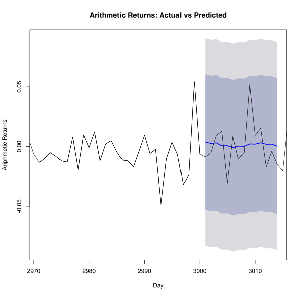
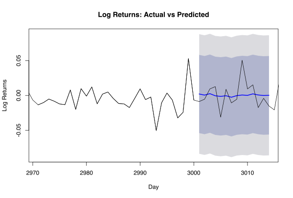
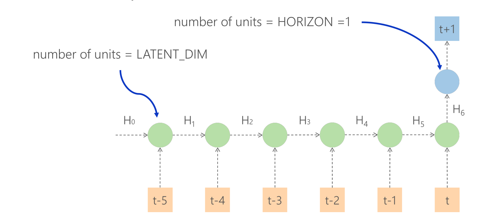
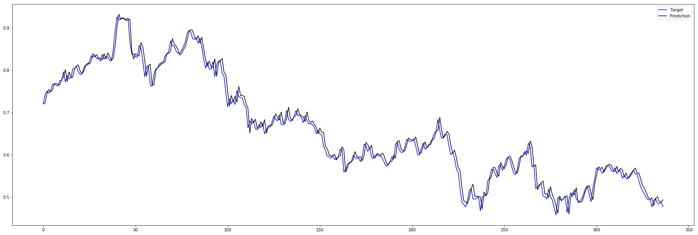

# Time Series Analisys

This is the report on the course final project for DSA 6100: Statistical Methods for Data Science and Analytics
By 

* Igor Ostaptchenko <igor_ost@wayne.edu>
* Ali Milhem <gu5993@wayne.edu>

The `R` source for this report is: 
The datasets: 
* AAL Daily: 

## Time Series Analisys

Time series is a series of data that occurs at a fixed intervals, for example: daily stock price, seasonal sales, etc. 
Time series analysis is the techniques of processing data based on the assumption that the successive values in the data represents measurements that take place in equal intevals. The purpose of time series analysis is to forecast future values of the time series variables. 


## Finantial data

Our purpose is to forcast the rate of return of American Airlines stock (AAL). We used the closing price starting from 09/27/2005 until 03/21/2019 as the basis f the analysis. We collected data from Yahoo Finance. The table include the following parameters: Date, Close, Open, High and Low. 

### AAL

American Airlines Group Inc (AAL) operates as a network air carrier; providing air transportation for passengers and cargo. As of December 31, 2018, the company operated a mainline fleet of 956 aircraft, whch makes it a major American airline company, and that is why we chose it for analysis. The data set is composed of the following parameters:
Date: on which the price is given.
High: is the highest price on that day.
Low: is the lowest price on that day.
Open: is the price at which the stock opened, when the stock market opened on that day.
Close: is the closing price on that day when the market closed. We based our analysis on this parameter.


## Fitting ARIMA

### Stationarity

Let's asses the Stationarity of AAL `Close` price values 

#### The Augmented Dickey-Fuller Test 
For the daily `Close` prices of AAL time series :

```
> print(adf.test(df.aal$Close,alternative = "stationary"))

	Augmented Dickey-Fuller Test

data:  df.aal$Close
Dickey-Fuller = -1.4708, Lag order = 15, p-value = 0.8024
alternative hypothesis: stationary
```

Stationary of the time series means that the statistical properties of it does not change; it's mean and variance do not change.
Based on the above test, we find the P-vale is high, which means that using ARIMA model to predict based on the price is not possible. Therefore, we will use `Returns` for prediction. 


### Moving focus to Arithmetic and Log Returns

Arithmetic Return: is calculated as the following:
Rt = (Pt – Pt-1) / Pt-1 = Pt / Pt-1 – 1.
Where: R: is the rate of return, t: time at which the return is calculated, Pt: the current price, Pt-1: the previous price.

Log Return: is calculated as the follwing formula:
Rt = log(Pt / Pt-1) = log(Pt) – log(Pt-1).
We use logarithms to calculate the return.


#### Transform `Close` prices to `Returns`
The `R` functions to calculate returns are as follows:

```r
ar_ret <- function(P) {c(NA, P[2:length(P)]/P[1:(length(P)-1)] -1)}
log_ret <- function(P) {c(NA, log(P[2:length(P)]/P[1:(length(P)-1)]))}
```

These functions will be applyed to the `Close` price vector and create two more columns `ar_ret` and `log_ret`

```
> df.aal$ar_ret <- ar_ret(df.aal$Close)
> df.aal$log_ret <- log_ret(df.aal$Close)
> head(df.aal)
        Date Close      ar_ret     log_ret
1 2005-09-27 19.30          NA          NA
2 2005-09-28 20.50  0.06217617  0.06031979
3 2005-09-29 20.21 -0.01414634 -0.01424735
4 2005-09-30 21.01  0.03958436  0.03882098
5 2005-10-03 21.50  0.02332223  0.02305442
6 2005-10-04 22.16  0.03069767  0.03023593
```
Notice that first row has blank returns. The first record will be dropped in future calculations


##### AAL


In the first chart (yearly scaled), we see that in 2008 there ere outliers (extreme values) in the chart. Afterwards, the fluctioations continue to occure but withou outlier values,; within a dcreasing range until after the year of 2011.
The other chart is for a different scale (monthly) which shows a stable trend.

##### Closer look on returns


#### The Augmented Dickey-Fuller Test on Returns

```
> # ADF test on ariphmetic return
> print(adf.test(df.aal$ar_ret, alternative = "stationary"))

	Augmented Dickey-Fuller Test

data:  df.aal$ar_ret
Dickey-Fuller = -13.646, Lag order = 15, p-value = 0.01
alternative hypothesis: stationary

Warning message:
In adf.test(df.aal$ar_ret, alternative = "stationary") :
  p-value smaller than printed p-value
> # ADF test on log return
> print(adf.test(df.aal$log_ret, alternative = "stationary"))

	Augmented Dickey-Fuller Test

data:  df.aal$log_ret
Dickey-Fuller = -13.709, Lag order = 15, p-value = 0.01
alternative hypothesis: stationary

Warning message:
In adf.test(df.aal$log_ret, alternative = "stationary") :
  p-value smaller than printed p-value
```

Conclusion: the Arithmetic and Log Returns Time Series is stationary enough thus allowing to apply ARIMA class models to forecast the time series.

###  Use Auto.Arima

The `R`s `forecast` package provides `auto.arima` function to select best ARIMA model according to either AIC, AICc or BIC value. The function conducts a search over possible model within the order constraints provided.

The first 3000 returns of `AAL` dataset will be used to train the model.

#### Find the best model for 3000 observations of `AAL` 

```
> aal.ar.autoarima <- auto.arima(df.aal[1:3000,]$ar_ret,
+                                max.order=300,
+                                trace = TRUE)

 Fitting models using approximations to speed things up...

 ARIMA(2,0,2) with non-zero mean : -10161.53
 ARIMA(0,0,0) with non-zero mean : -10158.63
 ARIMA(1,0,0) with non-zero mean : -10161.04
 ARIMA(0,0,1) with non-zero mean : -10160
 ARIMA(0,0,0) with zero mean     : -10158.25
 ARIMA(1,0,2) with non-zero mean : -10158.91
 ARIMA(2,0,1) with non-zero mean : -10158.22
 ARIMA(3,0,2) with non-zero mean : -10164.8
 ARIMA(3,0,1) with non-zero mean : -10156.83
 ARIMA(4,0,2) with non-zero mean : -10155.13
 ARIMA(3,0,3) with non-zero mean : -10177.41
 ARIMA(2,0,3) with non-zero mean : -10154.9
 ARIMA(4,0,3) with non-zero mean : -10164.45
 ARIMA(3,0,4) with non-zero mean : -10164.72
 ARIMA(2,0,4) with non-zero mean : -10156.56
 ARIMA(4,0,4) with non-zero mean : -10162.49
 ARIMA(3,0,3) with zero mean     : -10177.19

 Now re-fitting the best model(s) without approximations...

 ARIMA(3,0,3) with non-zero mean : -10184.57

 Best model: ARIMA(3,0,3) with non-zero mean 
 ```

For `ariphmetic` returns the best model is ARIMA(_p_ =3, _d_ = 0, _q_ = 3). Note that _d_ is 0 because the `Returns` is already a differentiated measure.

Let's see about `Log Returns`

```
> aal.ar.autoarima.log <- auto.arima(df.aal[1:3000,]$log_ret,
+                                max.order=300,
+                                trace = TRUE)

 Fitting models using approximations to speed things up...

 ARIMA(2,0,2) with non-zero mean : -10229.61
 ARIMA(0,0,0) with non-zero mean : -10226.48
 ARIMA(1,0,0) with non-zero mean : -10228.72
 ARIMA(0,0,1) with non-zero mean : -10227.68
 ARIMA(0,0,0) with zero mean     : -10228.36
 ARIMA(1,0,2) with non-zero mean : -10226.69
 ARIMA(2,0,1) with non-zero mean : -10226.01
 ARIMA(3,0,2) with non-zero mean : -10239.06
 ARIMA(3,0,1) with non-zero mean : -10224.36
 ARIMA(4,0,2) with non-zero mean : -10220.88
 ARIMA(3,0,3) with non-zero mean : -10244.42
 ARIMA(2,0,3) with non-zero mean : -10222.57
 ARIMA(4,0,3) with non-zero mean : -10230.23
 ARIMA(3,0,4) with non-zero mean : -10230.58
 ARIMA(2,0,4) with non-zero mean : -10222.16
 ARIMA(4,0,4) with non-zero mean : -10246.03
 ARIMA(5,0,4) with non-zero mean : -10245.72
 ARIMA(4,0,5) with non-zero mean : -10247.3
 ARIMA(3,0,5) with non-zero mean : -10243.32
 ARIMA(5,0,5) with non-zero mean : -10245.82
 ARIMA(4,0,5) with zero mean     : -10249.5
 ARIMA(3,0,5) with zero mean     : -10245.2
 ARIMA(4,0,4) with zero mean     : -10240.45
 ARIMA(5,0,5) with zero mean     : -10246.98
 ARIMA(3,0,4) with zero mean     : -10232.42
 ARIMA(5,0,4) with zero mean     : -10248.12

 Now re-fitting the best model(s) without approximations...

 ARIMA(4,0,5) with zero mean     : -10250.27

 Best model: ARIMA(4,0,5) with zero mean     
 ```

For `Log` returns the best model is ARIMA(_p_ = 4, _d_ = 0, _q_ = 5). Same: _d_ is 0 because the `Log Returns` is already a differentiated measure.

Let's asses the selected model parameters.

##### Arithemtic returns fit

```
> print(summary(aal.ar.autoarima))
Series: df.aal[1:3000, ]$ar_ret 
ARIMA(3,0,3) with non-zero mean 

Coefficients:
         ar1     ar2      ar3      ma1      ma2     ma3    mean
      0.5436  0.5205  -0.8897  -0.5292  -0.4805  0.8788  0.0013
s.e.  0.0424  0.0552   0.0325   0.0440   0.0568  0.0374  0.0008

sigma^2 estimated as 0.001958:  log likelihood=5100.31
AIC=-10184.62   AICc=-10184.57   BIC=-10136.57

Training set error measures:
                        ME       RMSE        MAE MPE MAPE      MASE      ACF1
Training set -1.406339e-05 0.04419841 0.02888782 NaN  Inf 0.7071239 0.0137817
                        ME       RMSE        MAE MPE MAPE      MASE      ACF1
Training set -1.406339e-05 0.04419841 0.02888782 NaN  Inf 0.7071239 0.0137817
```


#### Forecasting AAL on Arithmetic Returns

Lets run the forecast for 14 days ahead with the Residuals check
```
> f_ar <- forecast(aal.ar.autoarima, h= 14)
> checkresiduals(f_ar)

	Ljung-Box test

data:  Residuals from ARIMA(3,0,3) with non-zero mean
Q* = 13.101, df = 3, p-value = 0.004424

Model df: 7.   Total lags used: 10
```
TODO ALI - interpret the residuals bellow

##### Residuals of the Arithmetic Return Fit

Arithemtic Returns Fit Residuals:


##### The Arithemtic Return Forecast Errors 

```
> accuracy(f_ar,x=df.aal[3001:3014,]$ar_ret)
                        ME       RMSE        MAE      MPE     MAPE      MASE      ACF1
Training set -1.406339e-05 0.04419841 0.02888782      NaN      Inf 0.7071239 0.0137817
Test set     -7.936604e-04 0.01879774 0.01475044 106.2668 106.2668 0.3610654        NA
> 
```
TODO ALI: Please find how to interpret Errors?



##### Log Returns Fit
TODO ALi - explain what model is better comparing AIC, BIC and other params??
```
> print(summary(aal.ar.autoarima.log))
Series: df.aal[1:3000, ]$log_ret 
ARIMA(4,0,5) with zero mean 

Coefficients:
         ar1     ar2     ar3      ar4      ma1      ma2      ma3     ma4      ma5
      0.1674  0.1579  0.1176  -0.8557  -0.1406  -0.1308  -0.1099  0.8818  -0.0110
s.e.  0.2363  0.2416  0.1131   0.1287   0.2400   0.2168   0.0880  0.1263   0.0422

sigma^2 estimated as 0.001914:  log likelihood=5135.17
AIC=-10250.35   AICc=-10250.27   BIC=-10190.28

Training set error measures:
                      ME       RMSE        MAE MPE MAPE      MASE         ACF1
Training set 0.000267983 0.04368722 0.02885307 NaN  Inf 0.7083174 0.0007081013
                      ME       RMSE        MAE MPE MAPE      MASE         ACF1
Training set 0.000267983 0.04368722 0.02885307 NaN  Inf 0.7083174 0.0007081013

```

#### Forecasting AAL on Log Returns

Lets run the forecast for 14 days ahead with the Residuals check

```
> f_log <- forecast(aal.ar.autoarima.log,h=14)
> checkresiduals(f_log)

	Ljung-Box test

data:  Residuals from ARIMA(4,0,5) with zero mean
Q* = 18.839, df = 3, p-value = 0.0002952

Model df: 9.   Total lags used: 12
```
TODO ALI - interpret the residuals bellow

##### Residuals of the Log Return Fit

Log Returns Fit Residuals:


##### The Log Return Forecast Errors 

```
> accuracy(f_log, x=df.aal[3001:3014,]$log_ret)
                       ME       RMSE        MAE      MPE     MAPE      MASE         ACF1
Training set 0.0002679830 0.04368722 0.02885307      NaN      Inf 0.7083174 0.0007081013
Test set     0.0002783467 0.01844228 0.01419282 97.74705 97.74705 0.3484213           NA
```
TODO ALI: Please find how to interpret Errors?

## Fitting time series using ANN

The Artificail Neural Network forecasting for the same `AAL` data is done in the python notebook.
See: . The input layer for ANN has the same number of inputs as the desired number of intevals we want to look back. The primitive model is shown in the picture bellow. 


The data preparation is crutial steps and involves creating several aditional vectors for _y<sub>t</sub>_ and _x<sub>t</sub>_ for several values of _t_ [_t-1_, _t-2_ ...]. The detailed decription is in .

### The RNN forecasting results

The following results were aquired running `RNN` with `GRU` cell for forecasting the stock prices.



RNN Forecasting Errors:

```python
{'ME': -0.003913519198776012, 'RMSE': 0.01641030210773595, 'MAE': 0.012216668323480898, 'MPE': -0.6660415917080657, 'MAPE': 1.9340046033527194, 'MASE': inf}
```
Some values were not calculated

## Conclusions

The error metrics compared in the table bellow:
```
| Forecasting method |            ME |       RMSE |        MAE |       MPE |     MAPE | MASE      |
|--------------------|---------------|------------|------------|-----------|----------|-----------|
| ARIMA              |  0.0002783467 | 0.01844228 | 0.01419282 |  97.74705 | 97.74705 | 0.3484213 |
| RNN                | -0.0039135191 | 0.01641030 | 0.01221667 | -0.666041 |  1.93400 | -         |
```
While `RMSE`, `MAE` are at the same scale the ARIMA has shown less absolute value `ME`. Where `RNN` is superriour is in `MPE` and `MAPE`. The ARIMA error values for `MPE` and `MAPE` on this dataset renders it useles for predictions.

Overall in our opinion both methods are valuable options for the Time Series Forecasting. The ARIMA is more sensitive to data being non-stationary and financial data, unfortunatelly for ARIMA, has plenty of cases where the stationarity is possible to achive only by clever feature engineering. The some error measures in predictions of `Log Returns` were accepatble but ANN was able to acheave solid results on the four Price vectors. The ANN  has an advantage in multivariate Time Series analisys: all vectors are being fed to network simultaniously and contributed to prediction. The literature suggests however, that succesfull applications of ARIMA is possible for datasets avalable in natural sciense.
Both methods requred feature engeneering and data preparation to be usefull. The the process of creating aditional vectors and arrays are signigicantly more laborous for ANN: the amount of python code written is significant and possibility of erros increase in the absens of qualified data-sciense aware software engineers. Maybe with time the python libraries will be avaiable with the same level of abstraction avalable in `R` - the ultimate languge for statistical calculations. The 'R's ARIMA fit was done in signigicantly less time then training of ANN, that are more computationly intencive on the training phase. It will be interesting to see how ANN methods evolve to reach the `R`s ease of use and level of abstraction. 
