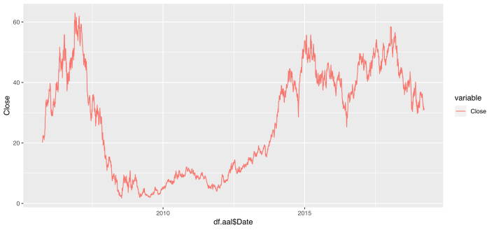
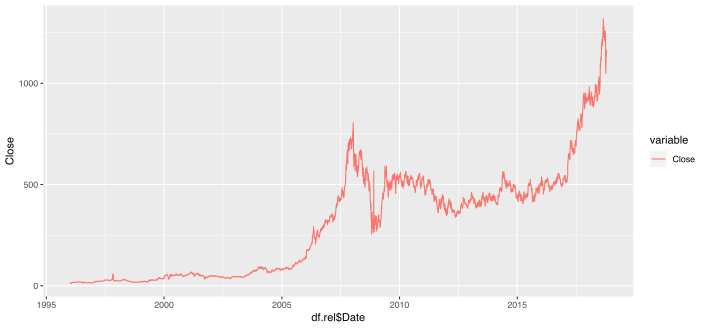
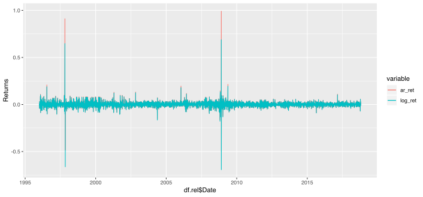
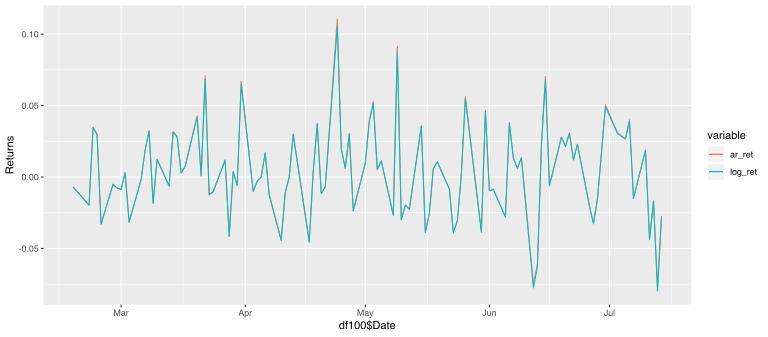

# Time Series Analisys
This is the report on the course final project for DSA 6100: Statistical Methods for Data Science and Analytics

## Time Series Analisys

## Finantial data

### AAL

### REL

## Fitting ARIMA

### Stationarity

#### AAL

#### Reliance

### Closer look on returns

